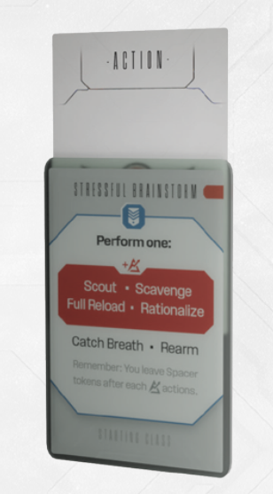

# Action Card

Each Spacer has 3 **special double-sided sleeved Action cards**. These are constructed before
each Extraction Run or Incursion by stacking together and placing into a single card sleeve the 3
cards granted by your Character, and the 3 granted by your Suit.

You always stack a **$\color{#ffc000}{\textsf{Yellow Character}}$** card with a **$\color{#ffc000}{\textsf{Yellow Suit card}}$**. You always stack a **$\color{#00b0f0}{\textsf{Blue Character}}$** card with a **$\color{#f00}{\textsf{Red Suit card}}$**. Yellow cards usually allow you to move and perform minor activities, Blue cards allow you to perform various specialized activities, while Red cards allow you to
attack.

Note that the **$\color{#00b0f0}{\textsf{Blue Character}}$** card allows you to perform a variety of non-combat actions.

**Important:** These pairs function as a single card, so you cannot use both sides of a given card
during the same turn (unless you Exert).

In the Dark Side of the Sun Demo, each player starts with the same Action cards. Stack
them in the following way:

- Stack **$\color{#ffc000}{\textsf{Steady Walk}}$** with **$\color{#ffc000}{\textsf{Cautious Sneaking}}$**
- Stack **$\color{#ffc000}{\textsf{Hurried Walk}}$** with **$\color{#ffc000}{\textsf{Anxious Sneaking}}$**
- Stack **$\color{#f00}{\textsf{Desperate Measures}}$** with **$\color{#00b0f0}{\textsf{Stressful Brainstorm}}$**

***Note:** Action Cards should be stacked back-toback so that both of their abilities are visible.*