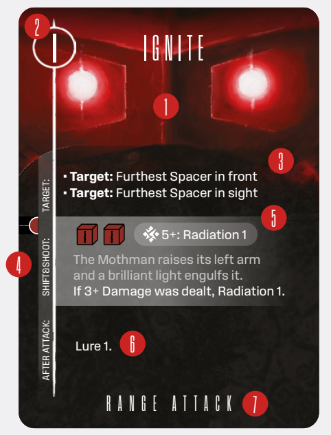
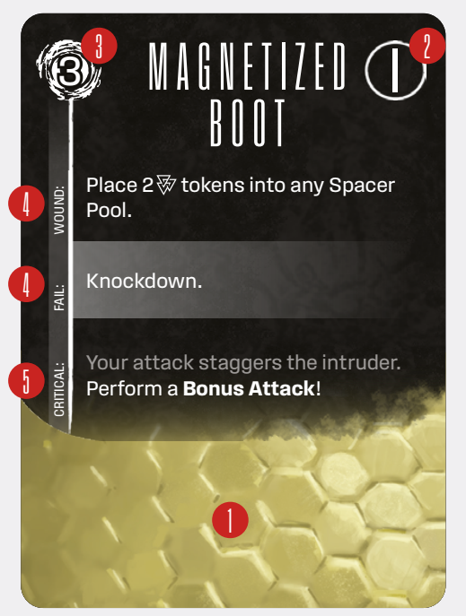

# AI And BP Decks

Boss Intruders are singularly powerful entities that
exert great influence on the world of Enormity.
Baselines usually have a single wound and a few
predictable protocols. Boss Intruders have complex
AI and BP decks that govern their actions and wellbeing.

The AI cards are like more sophisticated protocols.
Notice the **roman numeral** in the center of the
card back. This number indicates the level of the AI
card. So, although the AI cards are facedown, you
get some sense of how dangerous the next Boss
Intruder Attack will be.

  
*AI card*

AI card elements include an Intruder illustration
(1), card level (2), Targeting (3), Action instructions (4), Attack effect, including the dice you roll (5), After Attack effects () and the Attack
type (7).

Intruders are alien beings from beyond the rim of
Antinomy. Their xenobiology is strange and unfathomable, and that is represented by the BP cards.

  
*BP card*

BP card elements include an Intruder illustration
(1), card level (2), AT value (3), Responses (4),
Critical (5).