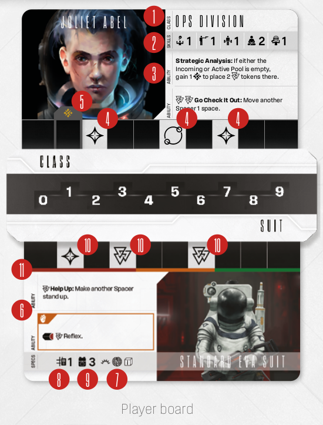
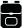

# Anatomy Of A Player Board

**Character card** statistics:

- **1 Class:** This tells you about your character’s specialization. Others cards may be unlocked or refer to your class. In the full game,
you will be able to develop your class.
- **2 Skills:** Each character has 5 skills,
Intelligence , Dexterity , Strength ,
Willpower , Perception , represented by
a numerical value. You will use these Skills
during Skill tests (see [Skill Tests](other-rules.md#skill-tests) on p. 37).
- **3 Abilities:** Each Spacer has unique abilities that will help them survive (see
[Abilities](other-rules.md#abilities) on p. 37).
- **4 Character Rubicon Bonuses:** Rubicon
bonuses are boons provided to your Spacer
when they perform an Adrenaline  action.
Usually, they take the form of Spacer tokens
you place into the Incoming Spacer Pool (see
[Spacer Pool and Spacer Tokens](spacer-pool-and-spacer-tokens.md) on p. 8).
- **5  Starting Stress:** This box represents
your starting Stress  level. Place your
Stress Indicator on the indicated rubicon
connector space.

**Suit card** statistics:

- **6 Abilities:** Each Suit has unique abilities
that will help you survive (see [Abilities](other-rules.md#abilities) on p. 37).
- **Specs:** Suits provide Spacers with vital survival systems, including:
  - 7  A light source, used for Scouting
Blips (see [Actions](actions.md), on p.14) and other
gameplay segments, from traversing
a dark corridor to braving the blackness
of open space.
  - 8  Slots for support equipment.
See the [Gear, Carrying Slots and Backpack](gear-carrying-slots-and-backpack.md) box on p. 12.
  - 9  Space in your backpack. See the
[Gear, Carrying Slots and Backpack](gear-carrying-slots-and-backpack.md) box
on p. 12.
- **10 Suit Rubicon Bonuses:** Rubicon bonuses are boons provided to your Spacer when
they perform an Adrenaline  action. Usually, they take the form of Spacer tokens you
place into the Incoming Spacer Pool (see
[Spacer Pool and Spacer tokens](spacer-pool-and-spacer-tokens.md) on p. 8).
- **11 Vitality Levels:** Notice the thin colored
bars beneath the rubicon bonuses track.
These red, orange and green sections represent vitality levels. They don’t do anything
on their own, but other game components
may refer to them e.g. Rudimentary Scanner. Simply put, your vitality level corresponds to the position of the Vitals Indictor.

---

- [**Next:** Rubicon Stats](rubicon-stats.md)
- [**Previous:** Spacers](spacers.md)
- [**^** Back to the table of contents](README.md)