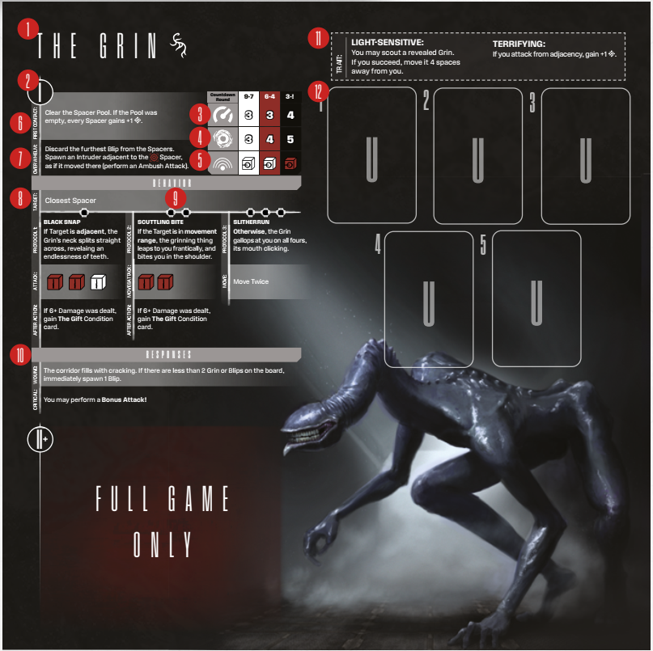

# Anatomy Of An Intruder

  
*Intruder Sheet*

**Intruder Sheet** statistics:
- **(1) Name:** This is the name of the Intruder
  type you’re facing, as named by the Spacers.
- **(2) Level:** This shows you the level of the
  Intruders you are facing. The applicable level
  depends on many factors, like the zone of
  the ship you’re in, the Course card you’re on
  and Escalation. Thankfully, in the demo, only
  level 1 is available.
- **(3) Speed:** This shows the basic movement
  speed of this type of Intruder.
  - **Baseline Intruders:** Note that the Speed, AT
    and Noise Awareness values of baseline Intruders depend on your current Countdown
    level. See Countdown Escalation on p. 27 for
    details.
  - **Boss Intruder:** Most Boss Intruders have
    unlimited Speed.
- **(4) AT:** This shows the strength needed
  to break through the Intruder’s Antinomy
  Threshold to deal a Wound (see Spacer Attacks on p. 19).
  - **Baseline Intruders:** Note that the Speed, AT
    and Noise Awareness values of baseline Intruders depend on your current Countdown
    level. See Countdown Escalation on p. 27 for
    details.
  - **Boss Intruder:** The AT values of Boss Intruders fluctuate even more; you will find them on the BP cards.
- **Wounds:** Some especially powerful Intruders have multiple Wounds .
  - **Baseline Intruders:** Baseline Intruders don’t
    have separate cards to show Wounds. You
    use the Wounded Status  token to denote
    them (see 3. Resolving the Attack Roll on p.20).
  - **Boss Intruder:** Boss Intruders have
    a whole deck of BP cards to represent
    Wounds.
- **(5) Noise Awareness:** This shows the type
  of die rolled when performing an Intruder
  symbol  Noise Roll.
  - Baseline Intruders:** Note that the Speed, AT
    and Noise Awareness values of baseline Intruders depend on your current Countdown
    level. See Countdown Escalation on p. 27 for details.
- **Range:** If an Intruder depends on ranged
  attacks, such as Shooting, it may have a
  dedicated Range value. Boss Intruders often
  have Unlimited Range.
- **(6) First Contact ability:** This ability is triggered immediately after the first specimen
  of the Intruder type is revealed on the board.
  See First Contact on p. 27 for details.
- **(7) Overwhelm ability:** This ability is triggered when you run out of Noise dice (see
  Noise Roll on p. 16).
- **(8) Target:** This shows the preferred, overriding prey of the Intruder. Usually, it will
  be the closest Spacer, but this can vary
  depending on the Intruder. Only baseline
  Intruders have this stat – Bosses are more
  sophisticated and use individual targeting
  based on their AI cards.
  - **Boss Intruder:** Each action and Attack of
    a Boss Intruder has its own targeting command line.
- **(9) AI Protocols:** These are complex behavioral commands that govern how the Intruders of a given type act (See B. Resolving AI
  Protocols on p. 28 for details). Only baseline
  Intruders have AI Protocols – bosses use AI
  cards. Note: Some Protocols may be Countdown level locked
- **(10) Responses:** This shows how the Intruder acts after being attacked (see 4. Intruder
  Responses on p. 22). Only baseline Intruders
  have responses on the Intruder Sheet – bosses use individual responses from BP cards.
- **(11) Traits:** Traits are various active and passive rules the Intruder utilizes. Some common rules will be represented by Intruder
  keywords (p. 38), while unique ones will be
  fully explained by the ability.
- **(12) Unique Specimen spaces:** Baseline Intruder sheets have spaces to place Unique
  Specimen cards.
- **AI and BP deck and discard spaces:** Boss
  Intruder sheets have spaces to place their AI
  and BP decks, as well as their discard piles.
- **Wound Stack:** Boss Intruder sheets have a
  dedicated space to place Wound cards and tokens.