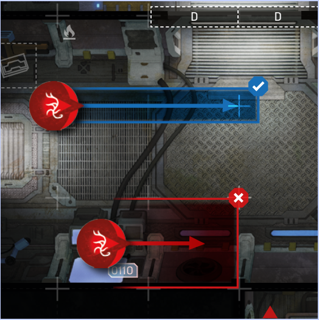
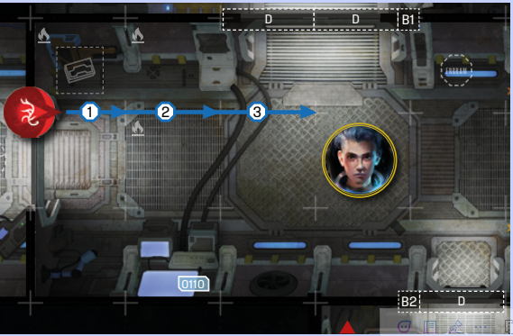
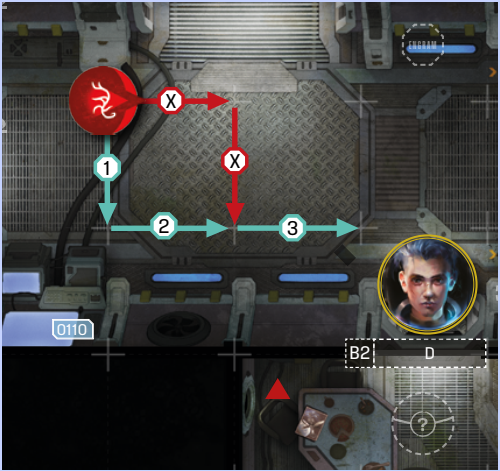
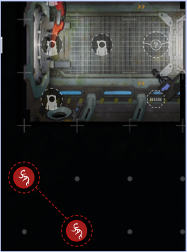
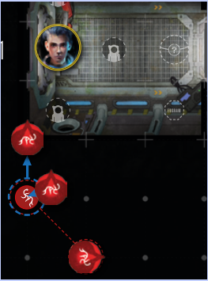
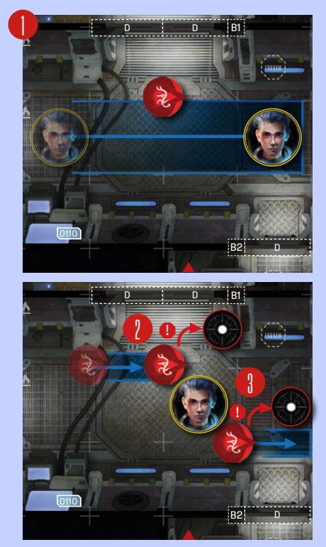
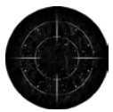
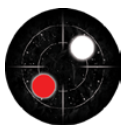
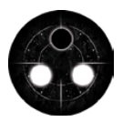
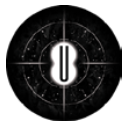

# Blip Movement

Unlike Spacers and Intruders, who move on board
spaces, Blips move **along lines, from intersection
to intersection**.

  
*Blips move from intersection to intersection, never
onto spaces*

As Blips are not considered Intruders (or miniatures
for that matter), they may move through closed
doors, obstacles, red lines and all other otherwise
impassable spaces and features, including Out-OfBound spaces.

To make it simple, assume that **wherever there are
intersecting lines on the Location map, Blips can
move**.

## Moving Blips as a result of Noise 

Whenever a Spacer **makes** a **Noise Roll**, they roll
as many dice as there are Blips on the board. Then,
they assigned each die result to a single Blip. After
the Spacer resolves their current action, **each Blip
will move towards them, by the amount of Noise
shown on the die assigned to them**, starting with
the closest Blip (i.e. if a Spacer assigned a die with
‘2’  to a Blip, that Blip would move two intersections towards them). See [Noise Roll](noise-roll.md) on p. 16.

Furthermore:

- If the Blip is on an intersection that aligns
  with the Spacer’s space, it moves in a straight
  line toward the Spacer.

    
  *Example of Blip movement*

- If the intersection and the space don’t align, i.e. the
  Spacer and the Blip do not share a board line, the
  first move should be performed in the direction that
  would take the Blip closer to potential alignment.
  After that the Blip will ‘zigzag’ towards the Spacer
  (See Intruder Movement on p.28), al ternating directions, until it arrives on an intersection that shares
  a line with the Spacer’s space, at which point it will
  continue to move in a straight line.

    
  *Example of Blip movement*

- If the Blip would ever move adjacent to or
  while adjacent a Spacer, it’s immediately
  revealed (see [Revealing Blips](#revealing-blips) on p. 18).

- Blips travel freely between Location map
  pages; the edges of two aligned pages create
  a single line.

- If, for whatever reason, the Location map
  pages don’t align, and a Blip is supposed
  to move from one to the other, it moves
  to the nearest intersection instead.

- If a Blip ends their movement on an intersection containing another Blip, move that other
  Blip immediately one intersection
  towards the Spacer.

## Spawning Blips

Unless stated otherwise, a new Blip always spawns
on a **spawn point ** closest to the Spacer who
triggered the spawn effect, facing the most Spacers. Furthermore:

- If no Spacer triggered the effect (for example,
  it was triggered by the Countdown marker
  moving onto a space with a  ), the Blip
  spawns closest to the  Spacer.

- If all spawn points are occupied, spawn the
  new Blip on the closest spawn point and
  immediately trigger Blip movement, as if the
  new Blip moved onto that space.

    
  *Blip spawn*

    
  *Spawning on an occupied spawn point*

- If, for whatever reason, no more Blips can
  be spawned, for each Blip that should spawn,
  trigger the Intruder’s Overwhelm ability,
  ignoring any Blip removal instructions.

## Sneaking Past Blips

Until revealed, Blips are just that, vague readings
on a foggy display. Whatever they are, they may not
even be on the same deck as you.

Consequently, a Spacer can move past a Blip,
or end their movement on a space adjacent to a Blip,
and not reveal it. **However, if a Blip would ever
move adjacent to or while adjacent a Spacer,
it’s immediately revealed!**

  
*A Spacer moving past a Blip (1) does not cause it
to be revealed. However, if the Blip moves onto an
intersection adjacent to a Spacer (2) , or is about
to move from an intersection adjacent to a Spacer
(3) , it is immediately revealed*

## Revealing Blips

When you are forced to reveal a Blip, flip it. If the Blip
turns out to be an Echo, it is removed from play, and
a new Blip is spawned according to normal spawn
rules (see [Spawning Blips](#spawning-blips) on p. 17).

If a Blip turns out to be an Intruder, or Intruders,
immediately spawn that Intruder on a space adjacent to the Spacer. If no such spaces are available,
spawn them on the nearest empty space. Then,
return that Blip to the Blip Pool (but don’t spawn
a new Blip).

|Symbol|Result|
|:---:|---|
||Nothing.   Discard this token.|
||Spawn 1 Intruder during Infiltration Phase or 2 Intruders during Eclipse and Extraction phase, then shuffle this token into the Blip Pool.|
||Spawn 2 Intruders during Infiltration Phase and Eclipse Phase or 3 Intruders during Extraction phase, then shuffle this token into the Blip Pool.|
||Spawn 1 random Unique Intruder, then shuffle this token into the Blip Pool.|

## Overspawn

If, for whatever reason, no more Intruders can be
spawned, for each Intruder that should spawn, immediately activate the farthest Intruder.

## Unique Specimen

If a revealed Blip turns out to be a Unique Specimen,
spawn it normally, then draw a random Unique
Specimen card and place it on the Intruder Board.
Then, place a corresponding number token under
the spawned Intruder to denote this.

## Ambush Attacks

**If a Blip reveals itself in the manner described
above, the spawned Intruder immediately acts
(see B. Resolving AI Protocols on p. 28).**

If you reveal the Blip through another means, like
the Scout action, you do not perform an ambush attack. In fact, if you reveal a Blip with a Scout action,
you will be able to turn the table on the
Intruders and perform an immediate attack against
one of the spawned enemies at no extra cost!
(See [Scouting](scouting.md)).