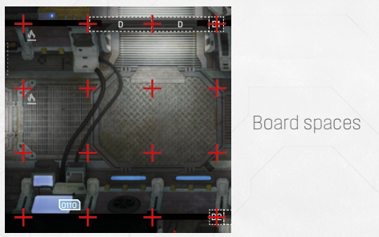
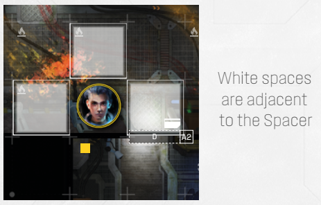
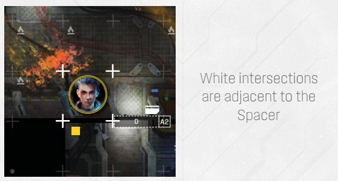
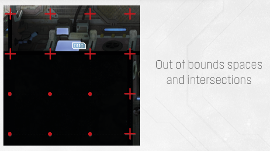
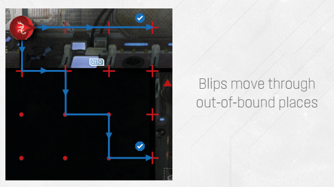

# Board Spaces, Adjacency, Lines, Intersections And Out-Of-Bounds Spaces

Take a good look at the Solar Ring location
map. Notice anything peculiar? It consists
of several rooms and corridors separated
by doors, and made out of square spaces.
These square spaces are called **board spaces**,
and are used for movement by both **Spacers
and Intruders**.

A space is **adjacent** if it shares a border
with another space. Diagonal spaces are
not adjacent. Obstacles and red lines block
adjacency.

A space can also be adjacent to an **intersection** - the point of crossing of two perpendicular lines - if it shares a corner with one. **Intersections are
used exclusively for Blip movement.** This reflects the
ephemeral nature of those scanner readings; unless an
Intruder is revealed, you never quite know where it is.

For this same reason, the board lines extend beyond
the boundaries of the rooms, creating a sort of
technical paper grid outside of the game space
proper. These ‘phantom’ spaces are called **out-of-bounds**, and are rarely used (usually by some
cross-dimensional entity that does not obey the
laws of physics!) However, the **intersections and
lines** that stretch beyond board spaces are routinely
used for Blip movement; this reflects the unseen
Intruders moving out-of-sight, through ventilation
shafts, crawl-spaces and other hard-to-reach areas.

While Spacers and revealed Intruders are subject
to board space restrictions (for example, they
cannot move through obstacles or beyond
room walls), Blips can travel freely through every
intersection on the Location map page (see Blip
Movement on p. 16).

