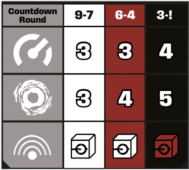

# Countdown Escalation

In Enormity, your enemies grow in power throughout the game session, just like the Spacers. Boss
Intruders follow special rules tied to gaining 
Wounds, called Escalation (see p. 35 for details),
while extraction run Intruders get stronger with the
growing level of the Countdown Track.

Whenever an effect or attribute shows several
values in Countdown colors, cross reference that
effect or attribute with the Countdown level and
apply the corresponding statistic.

  
*Stats dependant on the current Countdown level*

The most common attributes that escalate with the
Countdown level are **Speed**, **AT** and **Noise Awareness**. For example, on the **white** Countdown level,
the Grin have an AT value of 3. However, as soon
as the marker moves onto the first **red** Countdown
space, their AT rises to 4.

Note that this progression is not linear. Sometimes
an attribute can stay the same even if the Countdown level goes up. For example, the Grin have a
Speed value of 3 on both the **white** and **red** Countdown level.

Finally, if an attribute is shown as dice (like Noise
Awareness), their color does not necessarily correspond to the color of Countdown level. For example,
on the **white** Countdown level, the Grin use white 
during Noise Rolls. On the **red** Countdown level,
those dice remain white. 

**Remember:** Always check
the Intruder Sheet for Intruder statistics!