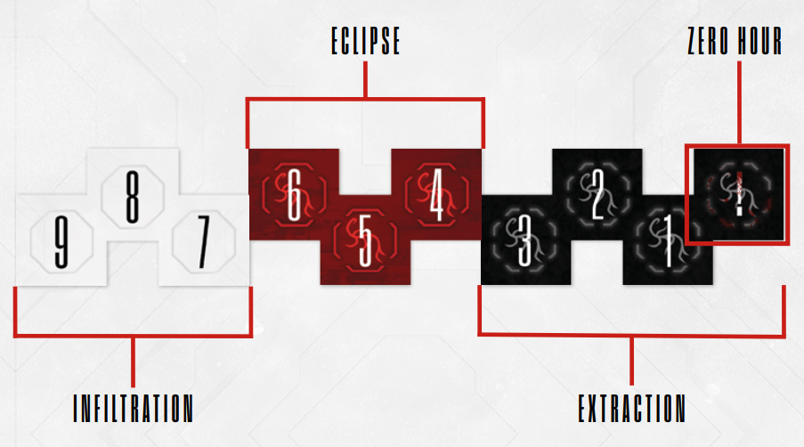

# Countdown Track

The Countdown Track represents the mounting pressure and Intruder
activity in your location. It’s divided into 3 levels, Infiltration (white),
Eclipse (red) and Extraction (black), which represent the escalating
danger. Each level is further divided into 3 spaces, corresponding to
game rounds. The final space of the track is called **zero hour **. The
Countdown Track **is not a timer**, so reaching zero hour does not mean
you’ve run out of time; it just means that the run is now extremely dangerous, and that potentially an Adversary boss Intruder needs to be
spawned.

Various thing, like Blips, Intruders, Discoveries, may end up on the
track; these are resolved during the Countdown Phase.

Besides those immediate effects, the position of the Countdown
marker influences the entire run; the particular effect is based on the
level. See the Countdown Level Effects box on p. 17 for more details.

