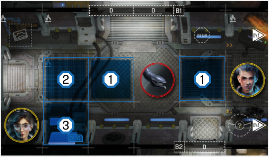

# Distance

Sometimes you will have to check the
relative distance between two game
objects, usually a Spacer and an Intruder (e.g. Closest or Furthest). Distance in
Enormity is always measured in spaces, and always orthogonally (in cardinal
directions), never diagonally.

  
*Measuring distance*