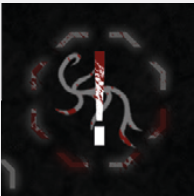

# 3. End Of Intruder Phase

Sometimes the Intruders will have some effect that
triggers at the end of the Intruder Phase. In such a
case, it’s resolved after all Intruder activations and
all other actions. If the Intruders have more than
one End of Round effect, the players may resolve
these effects in any order they choose.

After the end of the Intruder Phase, a new game
Round begins, starting with the Countdown Phase.

  
*The Zero Hour Countdown Track space.*