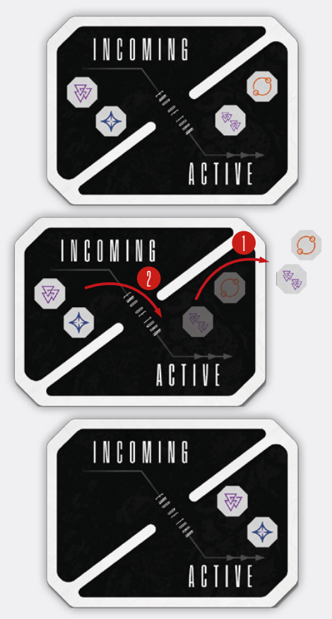

# End Of Spacer Turn And Milling The Spacer Pool

After you resolve all of your played Action cards (or
choose not to resolve them), use any abilities and
use any unlocked Stratagems (see Stratagems on p. 39), and are ready to pass the turn to another
player, mill the Spacer Pool.

To mill the Spacer Pool, first **discard all tokens
from the Active Pool**. Then, **move all tokens from
the Incoming Pool to the Active Pool**.

  
*To mill the Spacer Pool simply discard all the tokens
from the Active Pool (1), then move all the tokens
from the Incoming Pool to the Active Pool (2).*