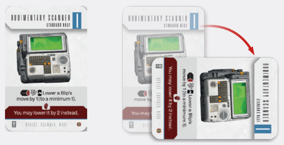

# Exhausing And Rearming

  
*Unexhaused and exhausted card*

When instructed to **exhaust** a card, you should turn
it 90 degrees to the right to denote it. It is still treated
as equipped, but you cannot use it as an active
weapon, use its defensive statistics or activate any
of its abilities except effects triggered by exhaustion
(e.g. “if exhausted”) or effects resulting in it unexhausting (e.g. “When you are knocked down, unexhaust
this card”). **Note: Passive abilities** remain in effect
even if a card they are printed on is exhausted.
Similarly, traits are always active. Cards remain
exhausted until they are unexhausted by another
effect (see below), most commonly by the use
of the **Rearm action**.

**Rearming** is an action that allows you to both unexhaust all exhausted cards, as well as equip Weapons
and/or Support Gear from your backpack and place
any currently equipped Weapons and/or Support
Gear into the backpack. Be mindful of your carry limit.

**Note: When you loot a Weapon or Support Gear,
you may perform Switch Weapons for free.**