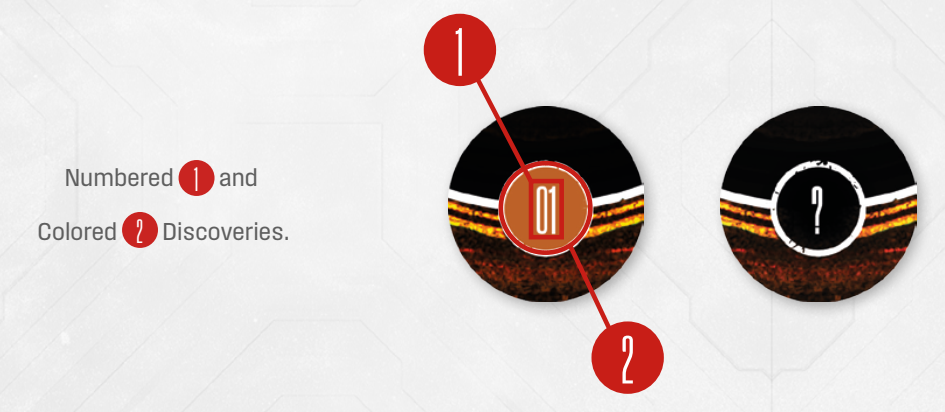

# Fixed And Colored Discoveries

Discoveries are all sorts of things you may find on the ship, as well as various events that
can happen while you explore it. Discovery tokens are **(1) numbered** and **(2) color-coded**.
If the location’s setup demands you setup any **fixed** discoveries, take those tokens and place
them face-up on the indicated board and Countdown Track spaces. Do not setup any other
Discoveries. Shuffle the rest of the Discovery tokens facedown. When you encounter these
discoveries, you will ignore their color and instead check the corresponding **Discovery card**.

If the location’s setup demands you **setup** random discoveries, take all Discovery tokens,
shuffle them facedown, then place them on all Discovery spaces of the board and the indicated
Countdown Track spaces. When you reveal these discoveries, you will ignore the number
and instead check the discovery in the Mythos book, based on color (see Discoveries on p. 23).

