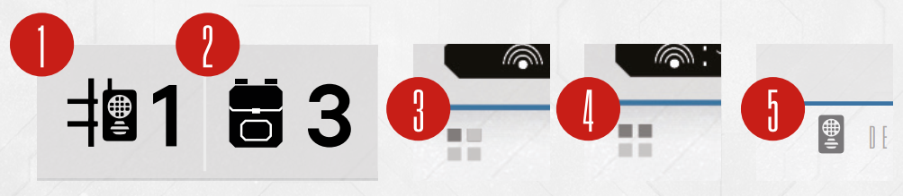

# Gear, Carrying Slots And Backpack

**Enormity** is an extraction dungeon crawler, and as such, will offer you a near infinite amount
of lootable Gear! Broadly, there are 2 types of Gear cards: Weapons and Support items.

**Weapon** cards are horizontal and take up 1 , 2  or more ‘hand slots’. A typical Spacer
has 2 hand slots, so they may equip 2 one-handed items or 1 two-handed item simultaneously.

**Support** cards are vertical and take up 1  each. Support slots are usually provided by your
Suit. The starting suit card has only 1 support slot, meaning you can only equip 1 support
Gear card.

**Backpack** provides additional slots for Weapons and Support cards. Each card in the backpack takes up 1 backpack slot, regardless of how many hands it needs to be equipped. Gear
cards in the backpack are not considered equipped. You cannot use them until you equip
them with the Rearm action (see Actions on p. 14). **Important: Always leave room in your
backpack for new Gear cards you may find during a run!**

*The amount of Support slots (1) and Backpack slots (2) is usually provided by your Suit Card. Weapons
can either take up one (3) or two (4) ‘hand slots’. Support cards always take one support slot (5).*