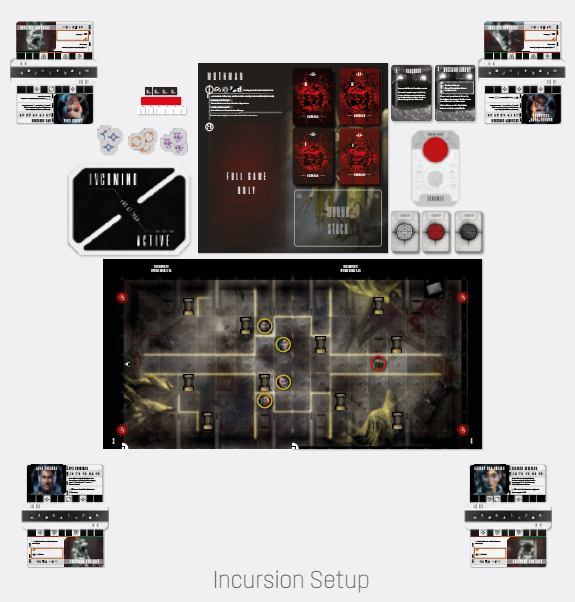

# Incursion Setup And Loadouts

Setting up an Incursion proceeds quite differently to
an Extraction Run:

1. **Open the Location and Intruder Books:** Based
on your Course card, open the appropriate Location
Book(s) to the indicated page(s). Open the Intruder
Book to the appropriate Boss Intruder’s page. Open
the Mythos Book to the page indicated in the Location Book.
2. **Spacer tokens and Power dice:** Place the Spacer Pool board near the Location book. Place the
Spacer tokens and Power dice within reach of all
players.
3. **Spacers:** Each player sets up their Loadout according to general [Choosing Loadout rules](extraction-runs.md#2-choosing-loadouts), found
on p. 11.
4. **Boss Intruder:** Place the oversized Intruder
Sheet above the board. Take all of the Intruder’s AI
cards and divide them into three decks numbered
I, II and III (you’ll find the roman numeral on the
back of the cards). Do the same for the BP cards.
Then place the AI and BP decks numbered “I” on
the designated spaces of the Intruder Sheet. Place
the decks numbered “II” and “III” to the side of the
Sheet. These are Escalation decks. Find the Trait
cards for any Traits that are not described on the Intruder Sheet and place them nearby as a reference.
5. **Location and Spacer Placement:** Find all the
Location cards and Terrain tiles used in the Battle.
Place the Location cards near the board and the Terrain tiles on the board, according to the Incursion
Diagram. Place the Spacers on the Spacer starting
positions as indicated by the diagram. Then proceed to Intruder positioning.
6. **Other components:** Depending on the Boss
Intruder, you may be instructed to prepare other
game components, specifically: Unique Specimen,
the Blip Pool and Blips, the Engram Pool and Engrams, the Countdown Track, Scanner Decks, additional Intruders, the Loot Deck and Loot Caches,
Closed Doors, Discoveries and other components.

  
*Incursion Setup*