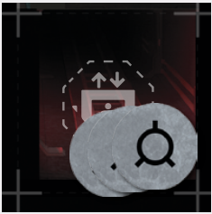

# Initiating Extraction

Extraction is available, you can initiate Extraction
from a space adjacent to the large Extraction Point
space  by using a Fast Scavenge  or Scavenge
Action.

When you initiate Extraction, several things happen. First, place X Exfiltration Status  tokens
on that Extraction Point, where X is the current
number of surviving Spacers. From this moment
onward, at the start of each Spacer’s turn, discard
1 token from the Extraction Point. As soon as you
discard the last token, the Extraction Point becomes a board space reachable from any adjacent
space. Any Spacer who ends their movement on
that space **extracts safely and is removed from
the board**. When all Spacers are either extracted or
dead, the run ends and, if at least 1 Spacer extracted, it is considered a success (if any of your Spacers
died, don’t worry, you have more lives, see Death and Life Spares on p. 42).

**Important:** Count Spacer turns, not game rounds
or Spacer phases!

  
*Extraction Point and time remaining to extraction,
counted in Exfiltration Status tokens.*

## Blips and Initiated Extraction

Sounds simple, right? Not quite. Extraction is loud
and draws the attention of Intruders who become
fully alert. At the beginning of every Intruder Phase
every Blip turns to face the Extraction space, and
always moves towards that space, utilizing zigzag
movement. As soon as a Blip on full alert moves
adjacent to the Extraction Point (as a result of patrolling or a Noise Roll), **it is revealed**.