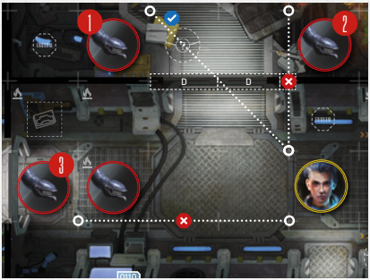

# Line Of Sight

A model is in LoS if you can draw a
straight, uninterrupted line from **any
corner** of the space occupied by the attacking miniature to **any corner** of the
space occupied by the potential target
of attack. If the line passes through
Obstacles, Intruders, walls (black lines)
or red lines, it is considered interrupted
and there is no LoS. If the line passes
along the edge of such space, it is also
considered interrupted. Conversely, if
the line only touches a corner of such
a space, it is uninterrupted, and there
is LoS. **Important:** A miniature never
blocks LoS to itself.

A Spacer must have LoS to the Intruder
to attack it. **An Intruder must have
LoS to the Target only if the command
line requires it to be in front or in sight.**

  
*Line of Sight Example: Juliet has LoS to the first Grin
(1), because the line can be measured to any corner
of the target. Juliet does not have LoS to the second
Grin (2), because the line cannot be drawn through
a wall. Juliet does not have LoS to the third Grin (3),
because there is another Intruder in the way.*