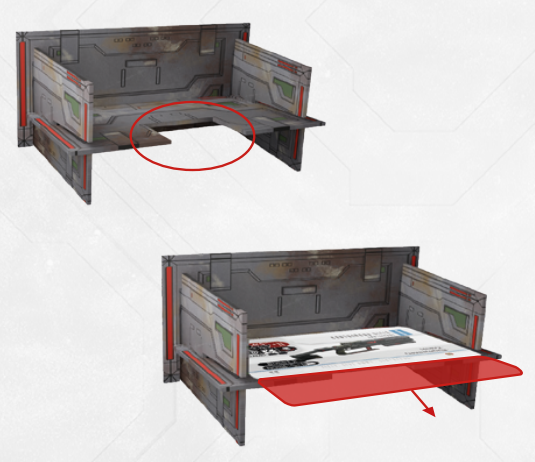

# Loot Dispenser

This structure is used to dispense loot
when you find it. The top of the deck
in the dispenser should always be covered with a Loot Cache Lid card. When drawing cards from the dispenser, you
always draw from the bottom.

***Note:** The Loot Dispenser has a small cutout at
the bottom to make grasping the bottom card
easier*