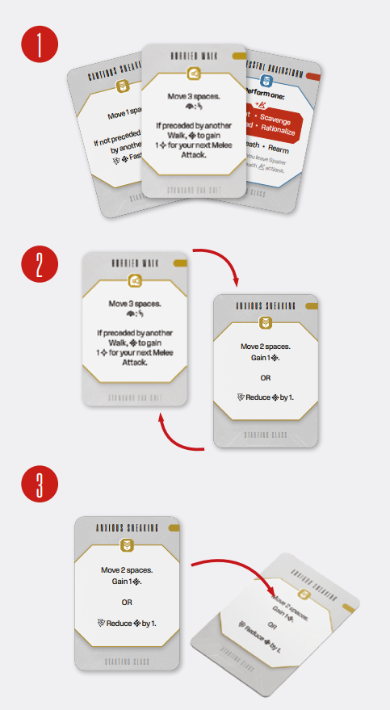

# Playing Action Cards And Performing Actions

During your turn, you will spend most of your time
playing **Action cards** to perform **actions**. You may
play up to 3 cards, which coincidentally is the number of cards you have, and in most circumstances
you will want to play all three. Note that your Action
cards are double-sided (see Action Card on p. 11), so
you will still use only 3 out of 6 possibilities.

Some Action cards allow you to perform **a single
type of** action (i.e. Desperate Measures can only be
used to perform an Attack action). When you play
such a card, simply resolve that action.

Other cards let you **choose** from two or more actions (i.e. Steady Walk allows you to perform a Move
action or Fast Reload action). In these cases, you
choose which action to resolve after play a card.

*At the beginning of your turn take all Action cards into
your hand (1). Before playing an Action card, you must
determine which side to resolve (2). To keep track of the
played Action cards by placing them on the table in front
of you, keeping the resolved side facing up (3). They will
stat on the table until the beginning of your next turn.*

## Adrenaline

Actions denoted with an Adrenaline  symbol are
called Adrenaline actions; when performing such
an action, immediately raise your  by 1 and apply **all
Rubicon Bonuses that are to the left of the Adrenaline Indicator**, both on the Character and Suit parts
of the player board; this will usually involve placing
Spacer tokens into the Incoming Spacer Pool
(see Spacer Pool and Spacer Tokens on p. 8).

---

- [**Next:** Actions](actions.md)
- [**Previous:** Spacer Phase](spacer-phase.md)
- [**^** Back to the table of contents](README.md)