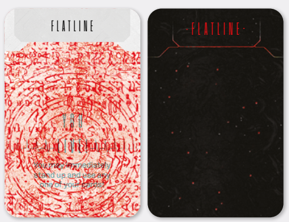

# B. Resolving AI Protocols

Unlike Boss Intruders, which have a broad range of
behaviors (represented by AI cards, see p. 32), each
type of baseline Intruder behaves differently, but in
a somewhat predictable manner. This is represented by AI Protocols.

  
*Baseline Intruder protocol example*

After establishing the target of the Intruder’s action, go through the list of AI Protocols in descending order. Each AI Protocol has a distinct name,
description and an additional **bolded requirement**,
usually defined as the target’s proximity to the Intruder (see the Distance box on p. 27).

Go through the AI Protocols one at a time, and
perform the first one whose bolded requirements
that are met. Do not check further protocols. **Note:**
There will always be at least one protocol you can
perform.

Usually, protocols will instruct you to perform an
action: move the Intruder, attack a Spacer, or both.

## Intruder Movement

Unless stated otherwise, when an AI protocol or AI
card instructs an Intruder to move, it will **always**
try to move as close to the Target as possible, up to
its Speed value, stopping only when it becomes adjacent to the Target.

**Note:** Some Intruders don’t have a Speed value; this
means they can move as many spaces as needed to
reach their Target.

**Note:** An Intruder performing a ranged attack (like
Shooting) will stop as soon as it is within range.

At the beginning of movement, an Intruder will
always **turn to face** the Target. Then, it will move
along the **shortest possible path**, that is, through
the fewest number of spaces. It can move through
any other game components (including other Intruders, Spacers and Terrain). Unless explicitly stated otherwise, it will not move through walls (black
lines).

An Intruder always moves **one space at a time**, in
cardinal directions (**never diagonally!**). If the Target
is not in a straight line from it, it will **“zigzag” move**
towards it cardinally, switching the movement axis
after every space travelled until it reaches a position that would allow it to continue moving towards
the Target in a straight line (see example below).
In such cases, the players may decide the starting
direction (horizontal or vertical) of the movement.

If two or more routes are considered equally short,
the players choose which one to use.

If any effect would cause the Intruder to move past
**the board edge**, it will continue to move along the
edge prioritizing a direction that will **initially** lead it
**away** from the most Spacers (if possible).

  

*Intruder Movement Example: The Grin moves towards the Spacer.
As it occupies a space in a different row, it will use “zigzag” movement. In the example above, the players decided to first move horizontally (1), then vertically (2) and then continue to move horizontally (as at this point the Grin is in the same row, so it will move in a
straight line). Note that the players could have also moved up first,
and then continued to move in a straight line toward the Spacer*

## Intruder Attacks

For an Attack to be resolved, the Target must be
within attack range. This is very easy for baseline
Intruders, as proximity is usually the requirement
dictating which protocol you’re using.

To perform an Intruder Attack, simply take the indicated number of colored dice, as shown in the AI
Protocol or on the AI card, and roll them.

### Damage

The number of Power  rolled is the amount of damage you receive. Before applying damage, you may
lower the amount by using any applicable Gear, as
well as Expertise  tokens (each discard token
lowers the damage by 1), to a minimum of 1.

### Gated Effects

Some AI protocols and AI cards have additional or
stronger effects depending on your  level or the
amount of damage dealt. This is always indicated
by a special banner, showing the  level or damage
needed for the effect to trigger, such as (( 3+: + )).
In this example, if your Stress was 3 or higher, you’d
have to roll an additional red die.

### Other Harm

Some attacks may deal additional negative effects
other than damage or instead of damage. For example, some Attacks deal  instead of damage, while
others deal Radiation or Infection tokens in addition
to damage.

### Receiving Damage

After performing the roll and applying damage mitigation, you must lower your Vitals  by the amount
of damage received. This brings you one step closer
to death, but may also have other, more immediate
effects:

-  If your Vitals go below 1, you have to perform
  a Flatline Check (see Flatlining on p. 30)
- If your Vitals and Stress indicators meet or
  pass each other, you suffer a Stress Breakdown (see Stress Breakdown on p. 37)

### Vitals Levels

Your Suit’s Rubicon bar indicates your Vitals levels –
green, orange and red; the Vitals level does nothing
by itself, but other game components may refer to
it (for example, an orange Vitals level may be a requirement to unlock a new ability)

## After Action Effects And After Attack Effects

After resolving the AI protocol’s action, resolve any
After Action Effects. After resolving an AI card’s
effect, resolve any After Attack Effects. Resolve
this even if the action itself was not resolved (with
the exception of Chain Break, see below).

##  Window Of Opportunity

Most protocols, AI cards, as well as some BP cards
and other game elements, give the players an opportunity to react to the situation, most often an
Intruder Attack, outside of their normal turn. These
are called **windows of opportunity** and are represented by the symbol . On protocols and AI
cards, the symbol will be always placed on the left
side of the card, next to an Intruder action.

Whenever you encounter the  symbol preceding an AI instruction, you may activate ** Reaction** abilities immediately, **before** you resolve that
instruction. During a single window of opportunity
each Spacer may activate any number of abilities
in any order, but no more than one ability with the
same name per Spacer.

If, for some reason, a Spacer moves outside of the
Intruder Attack’s range after becoming its Target
but before the Attack Roll, the Attack cannot be
performed and the roll, as well as any tied Attack
effects, is not resolved. Instead, the Intruder resolves any lingering movement towards the Target,
then proceeds straight to the **After Attack** actions
and effects.

## Chain Break

Some cards, abilities and other game elements may
allow Spacers to act during an Intruder or Spacer
Attack, slightly disrupting the natural flow of the
game. If the disruption is big enough, it may trigger
a **Chain Break**, immediately ending the original
Attack and invalidating all of its lingering Attack
effects, as well as After Attack effects.

If a **Spacer Bonus Attack** or additional Intruder Attack is triggered during an Intruder Attack, it causes a Chain Break and the original Intruder Attack
immediately ends.

If any game element instructs you to Chain Break,
the Attack currently taking place (if any) immediately ends.

In the case of Intruder Zone Attacks, a Chain Break
performed by one Spacer ignores any lingering Attack effects and After Attack effects for this Spacer only. Any other Target of the Attack must still
resolve them.

If, for any reason, a Spacer moves out of their weapon’s effective range after they attack the Intruder
but before they perform the Attack Roll, it causes a
Chain Break and the Attack immediately ends.

If a Chain Break happens during a Spacer Attack,
resolve the Leave Spacer tokens and Suppress
step before you proceed to resolving the effect that
caused the Chain Break.

**Note:** Spacer Bonus Attacks triggered during a
Spacer Attack are considered to be Follow-up Attacks. They do not cause Chain Breaks and are instead resolved after you finish resolving the current
Attack, much like Intruder Reprisal Attacks.

## Dying

In **Enormity**, there are numerous ways to die. Here’s
just a few of them:

- If your Stress  would ever go above 9, you
  suffer a **critical breakdown and die**.
- If your Adrenaline  would ever go above 9,
  you suffer a **heart attack and die**.
- If your Vitals  go below 1, usually as a result of receiving damage, you suffer a **flatline, which may result in death**.
- If you gain your 5th Radiation token or Infection token, you die.
- If you ever take your third Exert card, after
  resolving the extra action, you die.
- If an Intruder attack or environmental hazard results in instant death.

### Flatlining

As you can see, that’s quite a list. However, the
most common way of dying is through receiving
damage, having your Vitals reduced to below 1, and
flatlining. **Whenever your Vitals  go below 1, perform a Flatline Check.**

To perform the Flatline Check, take the Tac Scanner
and the 4 Flatline cards. Shuffle the cards, draw one
and insert it into the scanner to see what happens.
There are 2 ‘You Live’ cards and 2 ‘You Died’ cards,
so odds of surviving are 50 – 50.

Furthermore, one You Live reading may result in a
Bonus Attack (see Bonus Attacks on p. 41), while
one You Died card will result in an Awakening Roll
(see Awakening on p. 41). If you survived the Flatline
Check, your Vitals  still became 0 and every next
damage causes another Flatline Check.

**Note:** Resolved Flatline cards are **always shuffled
back** into the Flatline deck.

  
*Flatline card*

###Place of Death

You might have noticed there are 5 Dead Spacer tokens included in the game. In the Demo, they serve
little purpose. However, in the Full Game, you will
use them to mark your Spacer’s place of death. The
‘place of death’ will interact with several planned
mechanics, such as resuscitation, evacuating and
salvaging. Some Intruders may even take a special
interest in your friends’ corpses…

## Attacks Of Opportunity

Unlike Blips, Intruders are hyperaggressive. If you
would ever move **from** a space adjacent to an unsuppressed Intruder, that Intruder immediately activates before the move is performed, targeting the
moving Spacer. After the activation is resolved, you
may continue your movement (if you are able to).

## Surprised Intruders

It’s very hard to surprise an Intruder, but it does
happen. When it does, place a Surprise Status 
token near their bases to reflect that. When a surprise Intruder activates, the only thing they will do
is to discard the Surprise Status token, and any
Suppression tokens, it has. A surprised Intruder
does not perform attacks of opportunity.

