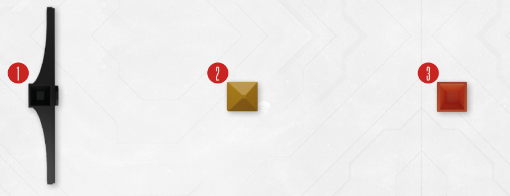

# Rubicon Indicators

These plastic markers are used to track your Spacer’s important statistics, Vitals , Adrenaline  and Stress . During gameplay, you will move these indicators along the rubicon
frequency to reflect the changes to your status, as a result of combat, anxiety and suffered
damage.

*(1) Adrenaline ,
(2) Stress ,
(3) Vitals *