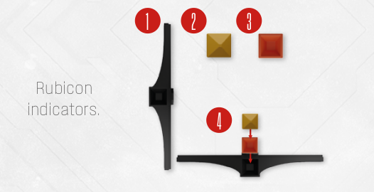
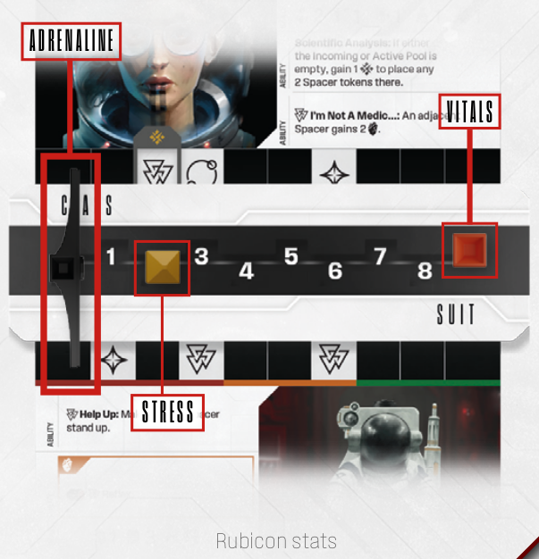

# Rubicon Stats

These three statistics represent your Spacer’s
physical and mental wellbeing, as well as combat readiness, as measured by your EVA suit’s
internal monitor

Unlike typical stats, these three are in flux.
(1) Adrenaline  and (2) Stress  will go up
as a result of attacking, using abilities, making
re-rolls and being exposed to intense fear, while
(3) Vitals  will go down as the result of getting
physically hurt. You will track rubicon stats
with plastic stackable (4) Rubicon indicators.

Rubicon stats usually operate on a scale of 0
to 9. Gaining or losing Rubicon stats over or
under these values will have dire consequences!
Thankfully, these stats will reset after each run.

## Vitals

Vitals  represent your overall physical condition.

Your  will go down as a result of suffering
**damage** from Intruders, the environment or
other story-related sources.

If your  would ever go below 1, you suffer a
**flatline**. Draw a Flatline card and check it with
the Scanner. As a result of a Flatline, you may
die, perform a counter attack or even awaken
some unknown force inside you (see Flatlining
on p. 30).

Regaining  is difficult, but not impossible,
there are abilities and items in the game that
facilitate this.

The first time your Vitals  and Stress  indicators meet or pass each other, you will suffer a Stress Breakdown (see Stress Breakdown on
p. 37).

## Stress

Stress  represents your overall mental
condition.

The most important Stress rule is: **whenever
you roll dice, you may always gain +1  to
re-roll any single die once**, even if that dice
was already re-rolled from another source.
**Remember this always, this is your ultimate
lifeline!**

Otherwise, you will gain  as a penalty from
various sources, or as a cost of high-risk actions.

The first time your Stress  and Vitals  indicators meet or pass each other, you will suffer
a Stress Breakdown (see Stress Breakdown on
p. 37).

To lower Stress , you will be using the **Rationalize** action (see Actions on p. 14).

If your  would ever go above 9, you suffer
a **nervous breakdown** (see Dying on p. 29).

## Adrenaline

Adrenaline  represents your overall combat
readiness. You gain  by performing certain
actions, like attacking, scouting or rationalizing
(see Actions on p. 14).

If your  would ever go above 9, you suffer
a **heart attack** (see Dying on p.29).

---

- [**Next:** Spacer Pool And Spacer Tokens](spacer-pool-and-spacer-tokens.md)
- [**Previous:** Anatomy Of A Player Board](anatomy-of-a-player-board.md)
- [**^** Back to the table of contents](README.md)