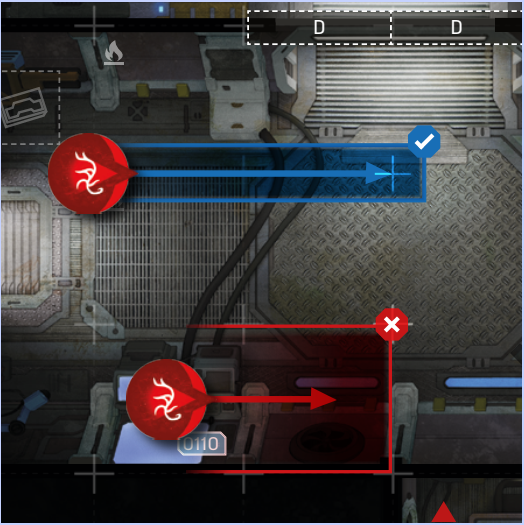
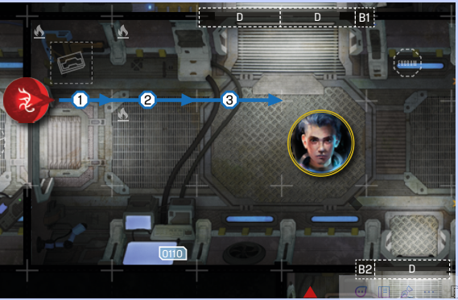
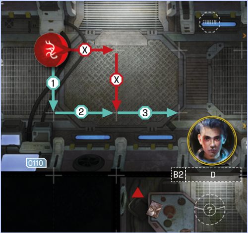
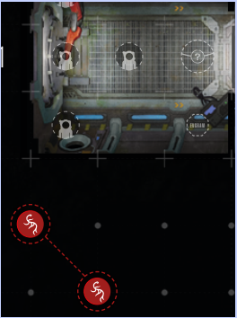
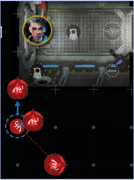
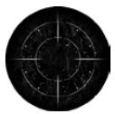

# Blip Movement

Unlike Spacers and Intruders, who move on board
spaces, Blips move **along lines, from intersection
to intersection**.

  
*Blips move from intersection to intersection, never
onto spaces*

As Blips are not considered Intruders (or miniatures
for that matter), they may move through closed
doors, obstacles, red lines and all other otherwise
impassable spaces and features, including Out-OfBound spaces.

To make it simple, assume that **wherever there are
intersecting lines on the Location map, Blips can
move**.

## Moving Blips as a result of Noise 

Whenever a Spacer **makes** a **Noise Roll**, they roll
as many dice as there are Blips on the board. Then,
they assigned each die result to a single Blip. After
the Spacer resolves their current action, **each Blip
will move towards them, by the amount of Noise
shown on the die assigned to them**, starting with
the closest Blip (i.e. if a Spacer assigned a die with
‘2’  to a Blip, that Blip would move two intersections towards them). See [Noise Roll](noise-roll.md) on p. 16.

Furthermore:

- If the Blip is on an intersection that aligns
  with the Spacer’s space, it moves in a straight
  line toward the Spacer.

    
  *Example of Blip movement*

- If the intersection and the space don’t align, i.e. the
  Spacer and the Blip do not share a board line, the
  first move should be performed in the direction that
  would take the Blip closer to potential alignment.
  After that the Blip will ‘zigzag’ towards the Spacer
  (See [Intruder Movement](resolving-ai-protocols.md#intruder-movement) on p.28), al ternating directions, until it arrives on an intersection that shares
  a line with the Spacer’s space, at which point it will
  continue to move in a straight line.

    
  *Example of Blip movement*

- If the Blip would ever move adjacent to or
  while adjacent a Spacer, it’s immediately
  revealed (see [Revealing Blips](#revealing-blips) on p. 18).

- Blips travel freely between Location map
  pages; the edges of two aligned pages create
  a single line.

- If, for whatever reason, the Location map
  pages don’t align, and a Blip is supposed
  to move from one to the other, it moves
  to the nearest intersection instead.

- If a Blip ends their movement on an intersection containing another Blip, move that other
  Blip immediately one intersection
  towards the Spacer.

## Spawning Blips

Unless stated otherwise, a new Blip always spawns
on a **spawn point ** closest to the Spacer who
triggered the spawn effect, facing the most Spacers. Furthermore:

- If no Spacer triggered the effect (for example,
  it was triggered by the Countdown marker
  moving onto a space with a  ), the Blip
  spawns closest to the  Spacer.

- If all spawn points are occupied, spawn the
  new Blip on the closest spawn point and
  immediately trigger Blip movement, as if the
  new Blip moved onto that space.

    
  *Blip spawn*

    
  *Spawning on an occupied spawn point*

- If, for whatever reason, no more Blips can
  be spawned, for each Blip that should spawn,
  trigger the Intruder’s Overwhelm ability,
  ignoring any Blip removal instructions.

## Sneaking Past Blips

Until revealed, Blips are just that, vague readings
on a foggy display. Whatever they are, they may not
even be on the same deck as you.

Consequently, a Spacer can move past a Blip,
or end their movement on a space adjacent to a Blip,
and not reveal it. **However, if a Blip would ever
move adjacent to or while adjacent a Spacer,
it’s immediately revealed!**

  
*A Spacer moving past a Blip 1 does not cause it
to be revealed. However, if the Blip moves onto an
intersection adjacent to a Spacer 2, or is about
to move from an intersection adjacent to a Spacer
3, it is immediately revealed*

## Revealing Blips

When you are forced to reveal a Blip, flip it. If the Blip
turns out to be an Echo, it is removed from play, and
a new Blip is spawned according to normal spawn
rules (see [Spawning Blips](#spawning-blips) on p. 17).

If a Blip turns out to be an Intruder, or Intruders,
immediately spawn that Intruder on a space adjacent to the Spacer. If no such spaces are available,
spawn them on the nearest empty space. Then,
return that Blip to the Blip Pool (but don’t spawn
a new Blip).

|Symbol|Result|
|:---:|---|
||Nothing.   Discard this token.|
||Spawn 1 Intruder during Infiltration Phase or 2 Intruders during Eclipse and Extraction phase, then shuffle this token into the Blip Pool.|
||Spawn 2 Intruders during Infiltration Phase and Eclipse Phase or 3 Intruders during Extraction phase, then shuffle this token into the Blip Pool.|
||Spawn 1 random Unique Intruder, then shuffle this token into the Blip Pool.|

## Overspawn

If, for whatever reason, no more Intruders can be
spawned, for each Intruder that should spawn, immediately activate the farthest Intruder.

## Unique Specimen

If a revealed Blip turns out to be a Unique Specimen,
spawn it normally, then draw a random Unique
Specimen card and place it on the Intruder Board.
Then, place a corresponding number token under
the spawned Intruder to denote this.

## Ambush Attacks

**If a Blip reveals itself in the manner described
above, the spawned Intruder immediately acts
(see [B. Resolving AI Protocols](resolving-ai-protocols.md) on p. 28).**

If you reveal the Blip through another means, like
the Scout action, you do not perform an ambush attack. In fact, if you reveal a Blip with a Scout action,
you will be able to turn the table on the
Intruders and perform an immediate attack against
one of the spawned enemies at no extra cost!
(See [Scouting](scouting.md)).