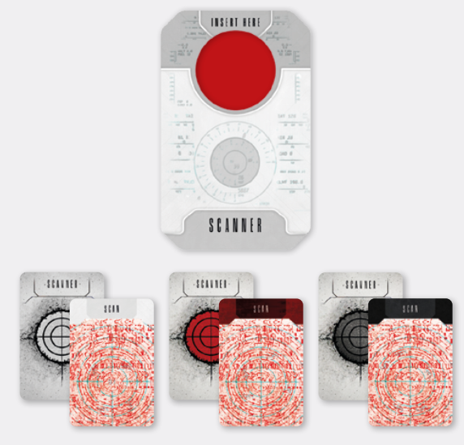

# 2. Blip Patrols

Generally, **Blips move each time someone makes
a Noise ** (see [Blips](blips.md), and [Blip Movement](blip-movement.md), on p.
16). However, even if Spacers remain perfectly silent, Blips will still go about their business, prowling
the deserted decks of the Shepherd in search of prey.
This is called **patrolling**.

The player with the  token takes the Tac Scanner
and draws a card from the Scanner Deck of the current Countdown level. Then, they align the scanner
with any board line (vertical or horizontal) and insert
the Scanner card into the scanner

  
*The cardboard Tac Scanner and Scanner cards*

A Scanner card seemingly shows only interference,
however, when inserted into the scanner, it will
reveal a **scanner reading divided into four quadrants**. These quadrants are relative to the position
of the  Spacer (i.e. that Spacer is considered to
be in the middle of the reading).

The reading also shows **Intruder symbols **. The
**number of symbols in a quadrant indicates the
speed** of Blips patrolling that quadrant (i.e., if the
quadrant north-western of the Spacer shows 3 ,
all Blips in that quadrant will move 3 intersections
each).

Patrolling Blip movement follows a few simple rules:

- Start with the Blip closest to the  Spacer
  and continue in this manner
- Unless otherwise stated, patrolling Blips
  move in a straight line, in the direction of
  their patrol arrows  (notably, this changes
  when the Countdown level hits **black**)
- Each Blip moves a number of intersections
  equal to the number of Intruder symbols in
  their quadrant of the scanner screen
- If a Blip moves onto a board edge, they turn
  180 degrees and move 1 additional time
- Otherwise, patrolling Blips follow the same
  movement rules as Blips reacting to Noise
  (see [Blip Movement](blip-movement.md) on p. 16 for details)

### Full Alert

If Extraction has been initiated (see [Extraction](extraction.md) on p.
24), at the beginning of every Intruder Phase every
Blip turns to face the Extraction space, and always
moves towards that space, utilizing zigzag movement (see [Intruder Movement](resolving-ai-protocols.md#intruder-movement) on p. 28).

As soon as a Blip on Full Alert moves adjacent to the
Extraction space (as a result of patrolling or a Noise
Roll), it is revealed.