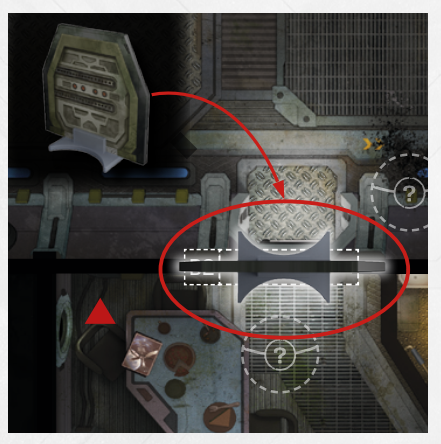

# Closed Doors

These cardboard structures represent
closed doors. Closed doors can be
opened from specific consoles. When
a closed door is opened, remove it from
the board. Unless otherwise specified,
an opened door remains opened until
the end of the run.

*If there's a standee on a door space,
that door is closed.*