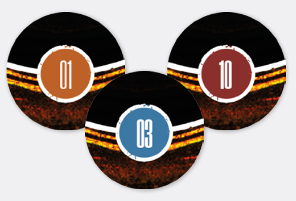
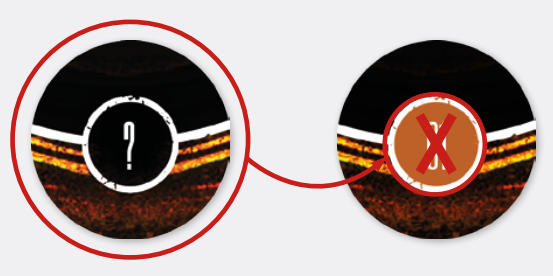

# Discoveries

*The Shepherd* has visited places none of Earth have
dreamed of. Those experiences have left a mark.
Scars. During your mission, you will uncover them.
You **need** to uncover them – why else risk your
necks out there?

Discovery tokens represent interesting, and potentially dangerous, things going on within the ship.
Events, encounters, enemies, friends, clues. A Discovery token may be any or none of the above.

Making Discoveries has its own **rewards** (like finding new Gear) and **penalties** (like disturbing something that should not be disturbed), but it is also
your overarching objective during Extraction Runs:
Extraction from your mission will become possible
only after making a certain number of Discoveries!
(See [Extraction](extraction.md) on p. 24 for details).

Resolving Discoveries is straightforward:

- Whenever a Spacer ends their move on a
  space with a Discovery token or a Discovery
  token triggers from the Countdown Track,
  resolve it.

**Note:** Resolving **fixed** Discoveries and **random** Discoveries flows slightly differently (see below).

After you resolve a Discovery token, discard it onto
a Discovery discard pile.

- Finally, move the Extraction Marker on
  the Countdown Track one space toward the
  zero hour space.

**Important:** In most runs this is necessary to make
extraction possible (see [Extraction](extraction.md) below).

## Scenarios: Fixed Discoveries

  
*Numbered Discoveries*

In the first scenario of the Dark Side of the Sun
Demo, **you will be using revealed Discovery tokens showing numbers**. When you enter a space
with a such a token, simply check its number and
look up the corresponding Discovery card. Then,
resolve the card. Note that a Discovery card may
then send you to read a paragraph in the Mythos
Book. If that’s the case, it will be accompanied by a
**4-digit code**.

## Open World: Random Discoveries

  
*Facedown and Random Discoveries*

If the setup didn’t instruct you to use fixed Discoveries, you will be using random discoveries instead.
In that case, when you reveal a Discovery token
(either from the board or Countdown Track), ignore
the number and instead check its **color**, then find
the appropriate section and chapter: your <strong class="blue">current
Location</strong> (i.e. Solar Ring), <strong class="yellow">current Parsec</strong> (i.e. First
Parsec), or <strong class="red">current Intruder</strong> (i.e. Automas).

Each section contains a set of Discoveries numbered in an ascending order, starting from ‘1’. To
make a Discovery, roll a d10 and add X to the result,
where X is the number of Discovery tokens already
in the Discovery discard pile (regardless of color).

## Resolution Boxes

Most Discoveries have **resolution boxes ** besides their names. When you resolve a given Discovery, mark its resolution box with a vinyl sticker
(in the Full Game) or pencil. That Discovery has
been resolved and you will not be resolving it again.
When you draw this same Discovery later:

If it’s a chained Discovery, you will resolve the next
one in that chain.

If it’s the last Discovery in a chain – it ends with an
 symbol – skip it and resolve the next Discovery
on the list.

##  Discovery Chains

Notice that some Discoveries are connected. Usually, the first Discovery in a chain is a numbered one,
while the rest are connected to it with the chain
symbol . When your Discovery’s resolution box
has been marked, if it’s a chain Discovery , resolve the next Discovery in that chain. Some chains
will be made of several Discoveries!

##  Infinite Discoveries

Some Discoveries have an infinity  symbol instead of a resolution box. These are never checked.
Consequently, you will always resolve infinite Discoveries.

## Penalties and Bonuses

If not stated otherwise, Discovery bonuses and
penalties affect only the Spacer who made them.

## Discovery from the Countdown Track

Whenever you make a Discovery from the Countdown Track (a fixed or random one), if the Discovery
is not global, and doesn’t specify who made it, it is
made by the  Spacer.

## Clues

If a Discovery tells you to gain a Clue, make a note
of it. Clues are shared by every Spacer present,
though you only note them once (in other words,
they are campaign-wide).

## Additional notes on Open World Discoveries

Some Discoveries may have special conditions that
need to be met before you can make them. If the
special condition is not met, you will proceed to the
next Discovery on the list.

Some Discoveries may outright exclude others (by
asking you to cross them out).

Some Discoveries may direct you to **ongoing storylines**, if you have any.

Some Intruder and Location Discoveries may still be
locked by the Parsec you’re currently on.

> [!TIP]  
> [Open World Discoveries In The Full Game](open-world-discoveries-in-the-full-game.md)