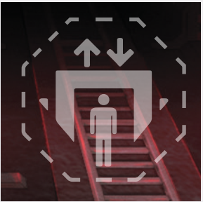
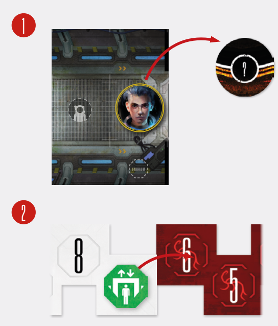

# Extraction

You’ve fulfilled your objectives, grabbed as much
loot and engrams as possible, and you’ve held your
own against the Intruders. Yet. sooner or later, you
will become overwhelmed, and it will be time to
go. If you manage to do it, congratulations, you’ve
successfully completed a run! We call this tactical
retreat an **Extraction**.

Extraction has 4 prerequisites:

1. There needs to be an **Extraction Point** on
the map.
2. Extraction needs to be **made available**.
3. You need to **initiate** Extraction.
4. You need to **wait** for the way to open and
then **escape** through it..

## 1. Locating an Extraction Point on the Map

Extraction Points are clearly marked with a special
large symbol. If the Location you’re in does not have
an Extraction Point, you may need to locate it, using
Consoles, revealing Discoveries or moving the story
forward!

  
*Extraction Point Symbol*

## 2. Making Extraction Available

When you go on a run, you have an overarching
mission, to learn what happened on the ship – you
will be hard-pressed to abandon it if you have not
learned anything substantial. This is represented by
the fact that Extraction Points need to be **activated**. In other words, Extraction – returning from your
mission –is not an option from the start of a run!

During setup, you’ve placed an Extraction Marker on the Countdown Track, on a space specified
by your current Course card or a scenario setup.
Whenever you make a Discovery (fixed or random,
from the board or from the track, it doesn’t matter),
move this marker one space toward the ‘!’ zero hour
space (see [Discoveries](discoveries.md) above).

  
*Whenever a Spacer makes a Discovery 1, move this
marker one space toward the  Zero Hour space 2.*

As soon as you move it onto the ‘!’ zero hour space,
remove it from the Countdown Track altogether.
From this point on, **Extraction becomes available
from any Extraction Point located on the map**.

Remember, even if Extraction Points are activated,
you still need to initiate Extraction manually (see
[Initiating Extraction](initiating-extraction.md)).

**Important:** In some cases, Extraction may become
available even if there are no Extraction Points currently on the board. Once an Extraction Point is located, Extraction is immediately available. Neat!

