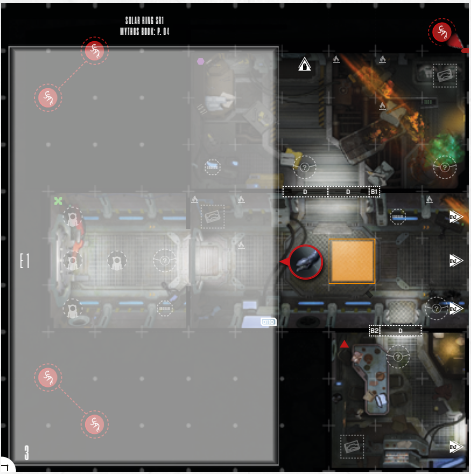

# Facing

Every miniature has a **front**, the direction it
is facing . Some targeting instructions and
other game elements may refer to a miniature’s facing, like **front** or **rear**. To find out if
a miniature or any other game element is **in
front** of another miniature, draw an imaginary line passing along the edges of the
spaces occupied by the **active miniature’s
front**. All spaces beyond this line in the direction the miniature is facing are considered to
be **in front** (see diagram).

**Rear** designates **only** the spaces adjacent to
the miniature, directly behind it (in relation to
the front).

  
*White spaces and intersections are in front, while the orange space is considered a Rear space*