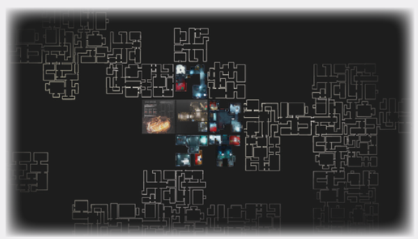

# In The Full Game

You have just got a glimpse of **Enormity**. The full
game offers so much more. Let me tell you what.

## Character Progression

Character progression in **Enormity** is rich and multilayered, focusing on several distinct spheres - gear,
suit, career, experience and your expedition scale –
that allow for near-endless build variety.

It wouldn’t be an extraction crawler without **Gear!**
Gear is all the equipment and weapons you find
during your extraction runs, loot from bosses, craft
at a crating station or gain in another of a variety
of more or less esoteric ways. Gear is perishable,
but there are ways to safeguard your most precious
possessions. Gear is interchangeable between
characters.

**Suits** represent milestone advancements, as they
provide a variety of increases for your Rubicon statistics, spacer tokens, skills and, most importantly,
your **action cards**. You can salvage, loot or craft
suits, based on recovered technology. Like Gear,
suits are interchangeable between characters.

**Careers** represent your characters particular professions, proficiencies and ship positions. In the
**Enormity** Demo the 5 pre-generated named characters have a fixed career, belonging to one of the
4 major divisions, while the full game will include
additional rules and components to chart your career across several positions and specializations.
Careers are tied to characters, so when a character
dies, so does this character progression!

You gain experience points per successful Extraction Run or Incursion. The back of your Class
cards shows the sprawling tree of progress that
career offers. Careers offer new abilities to unlock,
new Skill bonuses, Action bonus synergies, new
Slots, new Auto-tokens, new Career paths and
more.

Finally, there is **expedition scale**, sometimes called
a Nano-Kardashev scale, a kind-of world-wide or
campaign-wide experience players accumulate
while playing in a persistent world. This progression
involves knowledge of secrets, shortcuts, lore and
alien technology, and provides benefits to any character within the current campaign.

## Safe Havens

Mentioned briefly in the main part of the Rulebook,
are the safe havens, Locations and Location Maps
where you perform ‘downtime’ actions, like character development, crafting, researching technology.
During your campaigns, you will expand your Safe
Havens, adding new features, **base-building**.

## Resources, Crafting, Technology

In Enormity, there’s hundreds of items to discover,
loot, craft and research, from Gear, to Stratagem
to Suits, to [REDACTED], [REDACTED], [REDACTED].
The looting gameplay and crafting gameplay will
complement each other in various ways, creating
a sandbox of creativity, allowing you to make your
perfect character and loadout.

## Enormity Powers

The universe is infinitely vast and unfathomable.
There are things you will see, hear or experience
that neither you, nor anyone else, will be able to
explain or comprehend. Things so unknowable that
you might as well call them magic. Some of you
may learn to tap into these phenomena, steer their
inexplicable flow.

Know this: the more you delve into these phenomena, the closer you are to the Inner Dark.

## Metroidvania-Style Map

**Enormity** is a dungeon crawler that unfolds over
dozens of interconnected locations, like a true
metroidvania, with hundreds of passages, rooms, secrets and shortcuts, hundreds of gear and weapons
to salvage or craft, with alien ecologies that evolve
in real time based on your actions.

And we mean hundreds. The two books will consist
of **dozens of pages each**, to create the biggest
dungeon sprawl imaginable. Enormity’s board is
**one giant dungeon crawling map made of dozens upon dozens of sections**. Of course, there
are rules that will make sure the gameplay space
does not overwhelm you or your table - and that
only a few of the locations remain in play at a given
time. Those left behind will hide in a *fog-of-war*-type
**Veil**, but can always be revisited (well, unless you
chose to blow a whole section up to halt the alien
onslaught, that is. In that case you will have to look
for a detour…).

  
*The sprawl of the Shepherd disappears in the dark of space*

## Story And Storylines

**Enormity** has been designed as a sandbox experience, one which you can simply pick up and play,
and one you can replay endlessly, one you can
seamlessly expand with Locations, Biomes, Intruders, Gear and Discoveries. An rpg substitute: a
game that can last you a lifetime.

However, we, at ITU, love strong narrative stories.
And **Enormity** won’t be any different. The full game
will include 3 full-length narrative campaigns, with
their own beats, twists and endings. These will
serve as a great introduction to the world of **Enormity**.

## Campaigns

The base game features **three named campaigns**
(including the Dark Side of The Sun Introductory
Campaign), running upwards of 100 hours of gameplay. But that is only the beginning. Even going
through all those campaigns, you will have barely
seen the sprawling enormity of *the Shepherd*. Once
you find your footing, you will create your own modular sandbox campaigns, trying to delve even deeper into the ship’s secrets.

What all campaigns have in common is the **Course
Deck**. The Course Deck represents the course, and
final destination, of *the Shepherd*, for your campaign.

There are 3 types of Course cards: **Extraction Run**
cards, which allow you to go on an Extraction Run,
unlock new Locations on *the Shepherd*, introduce
new rules, lasting game effects and optional objectives, and **Incursion** cards, which force you to battle a fearsome Intruder Boss for your right to stay
on *the Shepherd*. The third type of Course cards gets
added to the deck from various sources (special
campaign setups, story passages, various events,
even Critical Wounds!): the Enormity **Mythos**
cards. Mythos cards move the metanarrative forward, revealing setting secrets and challenging
your characters in a myriad of ways. Many Mythos4 4
cards seed Mythos Cycles, which are sequences of
interconnected Mythos cards.

In terms of difficulty, Run and Incursion Course
cards are divided into difficulty tiers, called Parsecs, with a given Incursion card – introducing a
new Boss – serving as a gate-keeper (Normal Mode)
or proficiency check (Veteran Spacer) into the next,
harder Parsec.

The size of the Course Deck will be up to you. You
may play a short campaign, a long campaign, or an
endless campaign. Narrative campaigns will have
their set lengths – because every story needs a
strong conclusion to give it meaning.

## More Intruders, More Levels, And Evolution

The Dark Side of the Sun Demo is but a glimpse of
Intruder variety. The full game will offer dozens of
baseline Intruders, Unique Specimens and Boss Intruders, and each will have several levels that drastically change the monsters’ behavior and battles
(just check out Aeon Trespass: Odyssey for how
this works!). Intruders will also evolve over time…

## More Objectives, Combats Runs, Stealth Runs And More

The full game will feature dozens upon dozens
unique objectives, making for unique missions,
as well as completely new types of runs, like the
all-guns-blazing Combat Runs and the even more
tense Full Stealth Runs. And this is just the tip of
the iceberg…

## More Of Everything

Nuff Said: we’re known for cramming insane
amounts of content into our games, and Enormity
is no exception. Expect many more Spacers, Intruders, Boss Intruders, Locations, Gear, Abilities, Discoveries and much more of everything else too!

## Join Us!

**Enormity**, like all our previous games, is a crowdfunding endeavor. Games like this – bold, brave, big,
rich in content and innovation, delivering hundreds
of hours of engrossing gameplay, gripping high
quality narratives, ground-breaking concepts and
exquisitely detailed miniatures, would never see
the light of day without people like You. If Enormity
looks like something you think you’d like, consider
supporting us on Kickstarter for the best price, exclusive content and an opportunity to be a part of
something bigger than yourself. Something Enormous. Thank you!