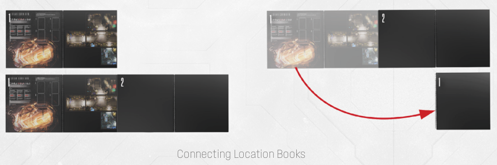

# Locations And Location Books

Extraction runs happen on an ever-expanding, ever-evolving inter-connected map of the
giant ship, *the Shepherd*. It is exactly what it sounds – one giant ‘Metroidvania’-style map you
can freely traverse, with distinct biomes, various routes and secret passages.

To facilitate this grand feat, Enormity utilizes **two special Location Books**, which you will
use alternatively to build a continuous map of the starship. In the full game, you will be able
to traverse even several sections during a single run, with special rules to govern token and
Intruder persistency.

For total immersion, your Spacers will remain on the board even in-between extractions and
incursions, in special safehouse locations.

