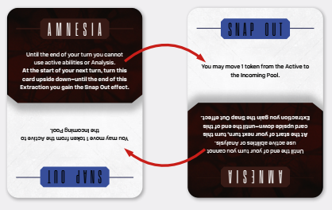
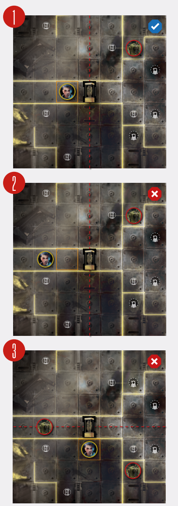
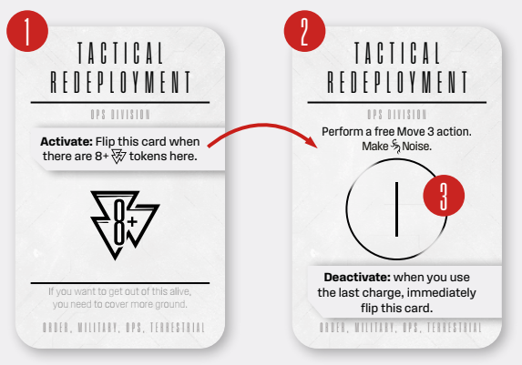
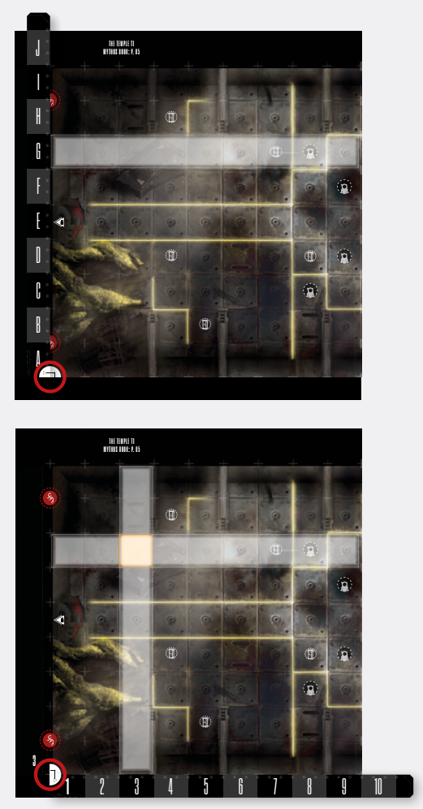
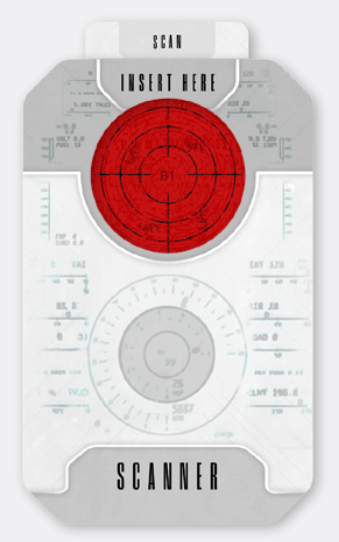
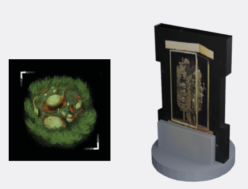
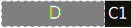

# Other Rules

## Conditions

Various effects (like Discoveries and Intruder actions) will cause Spacers to gain Condition cards that apply additional negative or
positive effects. When you gain a Condition
card, place it next to your Spacer Board. Some
Conditions may also require you to gain **Condition
tokens**. These are always placed on the corresponding Condition card, or, in the case of Radiation, directly on your Spacer Board. All Conditions
are discarded after the end of an Extraction Run or
Incursion.

  
*Condition card, Condition token and Radiation token*

Some Conditions may have additional **Lingering:**
effects that trigger if you were unable to get rid of
them before the session ended. If you gain a Condition card outside of a Run or Incursion, it remains
active until the end of the next Run or Incursion.

Some cards instruct you to gain a certain Condition, while others become Conditions themselves.
You cannot gain a Condition if you already have it,
but some Conditions may trigger additional effects
if you would gain them again.

## Stress Breakdowns

Space travel gets to you. The dark, the cold, the isolation. The void. In these conditions even the most
stalwart of souls begins to buckle. So, when the
Intruders show up, your mind is ready to give up.

The first time your Vitals  and Stress  indicators meet or pass each other during a Run, you will
suffer a Stress Breakdown. Immediately draw a random Stress Breakdown card and resolve its effect.

There is a silver lining here. If you manage to survive
your breakdown, you will come out stronger for it.
First, you won’t have to draw another Stress Breakdown for the entirety of the Run or Incursion.

Secondly, you flip your Stress Breakdown card, to
enable its bonus or ability. From now on, until the
end of the Run or Incursion, you possess that ability.

## Skill Tests

During your Runs, you will be often asked to perform a **Skill test**. These are generally associated
with a specific Skill (like Intelligence  or Strength 
). Note that each Spacer has at least 1 point in
every Skill.

To perform a Skill test, simply roll as many  dice
as your bonus to the appropriate skill and compare
the result to the difficulty of the test, expressed as
a target number called the Aptitude Threshold  - AT for short, and simplicity.

Skill tests can be re-rolled using  and , just like
Attacks, and  can be used to turn  into .

Some tests require you to achieve or beat a certain
AT, while others measure the degree of your success (I.e. the more successes  you get, the better).
Each Skill test you will be presented with will precisely tell you what is considered a success, and
what a failure.

## Abilities

Spacer cards, Suit cards, equipped Gear cards, as
well as other game elements, give you access to
various abilities. Some of them can be used as free
actions or as **reactions**, others will have a specific
timing condition or even grant a constant effect.

In general, each effect described within the **ability
box** of a card is an ability. The most common abilities are called keywords, and will be discussed on
p. 38. Unless stated otherwise, abilities are not actions.

## Passive Abilities

Abilities that **do not** require you to pay a cost or
fulfill any condition are called **passives**. **Passives**
are constantly interacting with the game as long as
they are in play. Most passives continuously seek
specific timing conditions and **must be resolved**
anytime the specified condition is met, unless the
ability text itself specifically says that “**you may**”
resolve its effect.

As a general rule, you must always resolve keywords that place Spacer tokens in the Spacer Pool
(like Discipline X), as well as keywords that hinder
you in any way (like Heavy). You generally **may** use
abilities that grant you move-like abilities (like Fallback X). See the [Keywords List](#keywords-list) on p. 38 to learn
more about using other keyword abilities.

As long as their conditions are fulfilled, passives
**can be used multiple times during the same
Round**.

## Triggered Abilities

These abilities require the Spacer to consciously
make a decision to use them. **As a result, unless
stated otherwise, you may only use them once
per Round.**

If the ability has one or more prerequisites (costs
and/or conditions), these are listed before the ability’s name or within its text. A player must always
meet the prerequisites of a triggered ability in order
to trigger that ability.

## Reactions

Reactions are a type of triggered ability denoted by
the reaction  symbol. Reactions are powerful
effects that may be performed during a **window of
opportunity** ([see p. 29](resolving-ai-protocols.md#window-of-opportunity-icon-window-of-opportunity)). As windows of opportunity
are generally found on AI cards, **Reactions allow
Spacers to act out of turn, during the Intruder
Phase**!

Whenever you encounter the  symbol preceding an instruction, you may activate abilities immediately **before** you resolve that instruction. During a
single  each Spacer may activate any number
of abilities in any order, but no more than one ability
with the same name per Spacer.

## Ability Costs And Free Abilities

In **Enormity**, anything can be an ability cost. Common costs include:

- Spacer tokens, like ,  and 
- Actions or Action cards
- Gaining Stress 
- Exhausting a game element
- Discarding a game element
- Discarding an Ammo  or charge  tokens.

Other, more specific costs may be listed in the particular ability.

Paying ability costs for usage is **always voluntary**
(you **may** pay the cost to resolve the ability). As
such, **these costs can never be prevented or ignored** by the use of other game effects.

Abilities that do not have a cost are called **free**.

You cannot activate an ability if you cannot pay its
full cost (e.g. an ability requires you to raise and
your  and it’s already at 9, or an ability requires
you to discard a charge and there are none remaining).

## Keywords

A keyword is an ability which conveys specific,
common rules. Each keyword has its own rules
which can be found on the keyword list below.
These are all **named abilities** and follow all of the
rules and restrictions of named abilities.

Some abilities are followed by a number, or X. Unless the ability text says otherwise, every such keyword is **stackable**. This means you may activate
several stackable keyword abilities with the same
name at the same time. Their effects then add up
and “stack.” For example, two separate Discipline 1
abilities would effectively be the same as Discipline 2.

## Keywords List

The following list of **Enormity** keywords is hardly
exhaustive, but covers all abilities presented in this
demo.

**Advance X:** When declaring an Attack with this
weapon, move up to X space towards the target.

**Burst:** This weapon can affect more than one target
with a single Attack. [See p. 22](spacer-attacks.md#burst-attacks) for details.

**Confidence X:** During the **Leave Spacer tokens
and Suppression step** of a Spacer Attack, place X
Confidence tokens into the Incoming Spacer Pool.
A single Confidence token allows you to re-roll any
single **Spacer Attack**, **Skill Test**, **Scouting Check**
or **Noise Roll** die **once**. **Note: You may later try to
re-roll that die with Stress !**

**Cover:** Terrain keyword. The target gains cover
from a ranged attack (like ‘Shoot’) if it is **adjacent**
to a Cover Terrain tile, and the tile is **between** it and
the Attacker. A tile is considered to be between two
figures if it is possible to draw an imaginary line
through the middle of a column or a row so that the
two figures are on opposite sides of that line. None
of the figures can occupy a space in either that column or row. Cover allows you to **lower the tier of
one of the Power dice of the Attack** (from  to 
or  to ).

  
*In the first example 1, the Spacer is in cover. They are adjacent
to the Terrain tile with the Cover keyword (as shown by the orange
box), and are on opposite sides of Terrain tile (as shown by the red
line drawn through the Terrain tile’s space). In the second example
2, the Spacer is not in cover: they are not adjacent to a Terrain tile
with the Cover keyword. In the third example 3, the Spacer is also
not in cover in relation to either Intruder. Although they are adjacent
to a Terrain tile with the cover keyword, they are it is not between
them (i.e they are not on opposite sides of the red line).*

**Crash:** This is an Intruder keyword. A Spacer subjected to Crash loses -1  and suffers Knockdown.
A Spacer suffers Crash each time an Intruder with
the keyword moves onto or
through their space, as well as when any effect
forces it to move onto a space with an Obstacle Terrain tile or places an Obstacle Terrain tile on theirs.

**Dazed:** Take a Dazed Condition Card.

**Destructible:** When a Spacer or **Intruder** is involuntarily moved onto this tile, or when a Boss Intruder moves through this tile, **or this tile is used for
Cover**, it is destroyed. **Note:** If a Spacer or baseline
Intruder is knocked back, they ignore non-Obstacle
Terrain tiles they move through. Therefore, they will
not destroy a Destructible tile unless they end their
movement on it.

**Discipline X:** During the **Leave Spacer tokens
and Suppression step** of a Spacer Attack, place X
Discipline tokens into the Incoming Spacer Pool. A
single Discipline token allows you to turn 1 Potential 
into a Success/Power  during a **Spacer Attacks**, **Skill Test**, **Scouting Check** or **Noise Roll**.

**Devastating:** If you roll a Crit Quadrant on a die, you
may roll an additional die of that color.

**Discharge:** During the Raise Adrenaline and Depleting Weapon Step place a Discharge Status  on
it. Discard this token at the start of your next turn.
Reload and Fast Reload actions **will not remove** a
Discharge Status  token.

**Displace:** Move the displaced target to an empty
space adjacent to its current position. If a Spacer is
displaced and there is no space it can be legally displaced to, they die instead.

**Empty Clip:** When depleting Ammo during an Attack, deplete all Ammo to gain +1 .

**Expertise :** During the **Leave Spacer tokens and
Suppression step** of a Spacer Attack, place X Expertise tokens into the Incoming Spacer Pool. This
token allows you to **pay the cost of many abilities**,
**actions**, **environment interactions** and **Stratagems**. Additionally, when you are attacked, you
may use  tokens to lower received damage, at a
ratio of 1 token per 1 , to a minimum of 1.

**Fallback X:** After resolving a Spacer Attack, but
before any Reprisal or Follow-up Attacks, you may
move X spaces away from the target of the Attack.

**Heavy:** This weapon can only be reloaded with a Full
Reload action.

**Indestructible:** Terrain keyword. This Terrain tile
cannot be destroyed in any way. It invalidates Terrain placement on top of it.

**Knockback X:** [See box](#knockback).

**Knockdown:** Gain the *Knockdown* Condition card,
*Falling down* side up, and place your miniature on
its side. Follow the rules of the Condition card. If
Knockdown is caused by an Attack, it affects the
Target only if it is within the Intruder’s effective
range (adjacent for Melee Attacks, in the designated zone for Zone Attacks, within X spaces for
Ranged X Attacks, etc.). If it’s caused by a Response, it affects the Attacker only if they are within adjacency.

**Lethal:** During intruder attack, treat all 
as .

**Light //:** Changes your Light source’s die
type to //.

**Linear:** Some ranged weapons require simple trajectories that limit their flexibility. If a weapon has
the Linear keyword, it can only shoot in straight
lines.

**Lure X:** Intruder keyword. Move the target of the
keyword X spaces towards the source of the keyword.

**Noiseless:** This weapon does not generate Noise
Rolls when used.

**Obscuring:** Terrain keyword. This tile blocks Line of
Sight.

**Obstacle:** Terrain keyword. Spacers and baseline
Intruders cannot move through Obstacles. Many
move-like abilities interact with Obstacles.

**Pushback X:** Turn the source towards the affected
miniature. Then, move X spaces in the direction of
the affected miniature, pushing it in a straight line.

**Radiate X:** If your target has not been killed, during
the **Leave Spacer tokens and Suppression step** of
a Spacer Attack, place X Radiation tokens on their
Intruder Sheet. During the draw BP card step of a
Spacer Attack, if the total number of Radiation tokens on the sheet equals the card’s AT, immediately
deal it as a Wound, suffering all responses, discard
all Radiation tokens, draw another BP card and continue the Attack (if able).

**Radiation X:** Intruder keyword. The Spacer gains X
Radiation tokens. When a Spacer gains their 5th Radiation token, they die.

**Reach:** The weapon is considered a Reach weapon.
If a weapon has the Reach keyword, it means it’s
actually not a ranged weapon, but a particularly
long Melee Weapon. You still count the distance
just like you would for range, but are not considered
using a ranged weapon for other game purposes.
The attack is considered a melee attack.

**Reflex:** Move up to 1 space.

**Warn:** Move another Spacer up to 1 space.

## Knockback

Move the affected miniature X spaces directly away from the source of Knockback in a
straight line (or in a specified direction in case of directional Knockback; [see examples on the next page](#knockback)).

- If Knockback is caused by an Attack, it affects the Target only if it is within the Attack’s effective range (adjacent for normal Attacks, in the designated zone for Zone
  Attacks, within X spaces for Ranged X Attacks, etc.).
- If Knockback is caused by an Intruder Response, it affects the Attacker only if they
  are within adjacency.
- Knocked back Spacers ignore all Terrain tiles they move through except Obstacles.
- If a Spacer would be forced to move through a Destructible Obstacle Terrain tile,
  stop its movement, remove the Terrain tile from the board and place the Spacer in
  its space, then that Spacer suffers **Crash**.
- If a Spacer would be forced to move through an Indestructible Obstacle, it stops on
  an adjacent space right before the Obstacle, then suffers **Crash**.
- Knocked back Intruders can move through any Terrain tiles and miniatures without
  hindrance. They destroy any Terrain tiles (except Indestructible) they move through
  and cause Crash and Unavoidable Knockback to Spacers as normal.
- If the affected miniature is knocked back into a Board Edge, it continues to move
  along the edge, if possible, away from the source of Knockback.

## Knockdown

Knockdown is a special Condition.
When you get knocked down, you put
your miniature on its side and take a
*Knockdown (falling down)* card. While
you have the *Knockdown (falling down)*
card, you cannot perform any actions,
reactions or use abilities, unless stated otherwise. At the end of your next
turn, you flip the card to the *Knockdown
(standing up)* side. All Spacers with a
*Knockdown (standing up)* card stand up
at the start of their next turn. If for
whatever reason this card is discarded,
stand up too.

## Stratagems

Stratagems are powerful team abilities. Some
Stratagems are unlocked by Spacer classes, while
others will be gained during play. During an Extraction Run or Incursion setup, you will choose
2 Stratagems to use.

Stratagems start play with the requirement side
up. Once the requirement is met, the card is immediately flipped and becomes ready to use. Once it
has been used the indicated number of times, it is
again flipped to the requirement side. A Stratagem
card can be flipped in this way several times during
a single session!

Usually, for a Stratagem to become active, players
will be required to expend Expertise  tokens. To
expend an Expertise token for a Stratagem, simply
move it from the Active Spacer Pool to the Stratagem card. You may do this at any point of your turn.

  
*The Requirement 1 and Ability 2 sides
of a Stratagem card. 3 number of charges.*

## Locations

In the Dark Side of the Sun Demo, you will find all
the necessary Location information in the **Mythos
Book** (see Mythos Book, p. 4 for the first scenario!).
In the full game, Location information, like special
rules, effects, loot and engrams, as well as additional setup, will be located on Tarot sized **Location
cards**.

Each Location has a **designation**, for example SR
(for Solar Ring). Whenever you reach a new Location
in the either Location Book (a Location with a new
designation), you will draw the appropriate Location
card (or check the page in the Mythos Book, in the
case of the demo).

Although, for ease of use, the Location Setup is
usually printed upon the Location Book page itself,
some Location cards may feature additional setup
instructions, or even an alternate setup diagram – 
some places on *the Shepherd* will change as you
explore it.

Each Location has its distinct **alien ecology**, a fancy way of saying which Intruders you will be facing
in that corner of the ship. Note that sometimes a
Course card may override this ecology!

A Location will always indicate the **Loot Deck** you
should use while exploring it ([see p. 11](extraction-runs.md#1-preparing-location-setup)), as well as
show the Location’s **Engram selection**. That’s right,
although there are only 4 types of double-sided Engram tokens in the game, they represent different
things in different Locations. Each Location will tell
you exactly what ability each of those 4 Engram
types has, as well as into which resources they will
transform when you extract.

Finally, a Location may have **special rules**. These
may be **constant Location rules**, akin to passive
abilities, things that you have to contend with
throughout your entire stay in that Location, like
Lack of Oxygen, Lack of Gravity, Poisonous Atmosphere and so on.

Then you have **Location abilities and reactions**.
These will tell you how to use them and when.
For example, the Solar Ring has an ability called
**Abrams Flare**: During your turn, if any Intruder is on
a  space, pay **ONE**//**TWO**//**THREE** Discipline  to
Suppress Fire 1 .”

Finally, a Location may allow you to perform a special **Location action**. These will also tell you how to
use them and when. These are considered actions,
and will usually ask you to play (use) an Action card
as part of their cost.

## Coordinates

Sometimes it’s necessary to know exactly where
on the board a game element should be placed or
moved, or where an effect is taking place. Sometimes the effect will specify its placement **contextually**, for example ‘adjacent to the closest Spacer’
or ‘on every  space’.

### Algebraic Notations

Other times, the coordinates will be named as
**algebraic notations**, that are specified by a combination of a letter and a number, for example ‘H3’
– exactly like in Chess. To find an algebraic notated
coordinates:

1. Take the double-sided Coordinates Ruler and
flip it to the **Alphabet side**.
2. Align it **vertically** with the **orientation
quadrant** of the appropriate Location Map
page, so that the two quadrants form a
semicircle, and read the letter part of the
coordinates.
3. Flip the Coordinates Ruler to the **Numerical
side**.
4. Align it **horizontally** with the **orientation
quadrant** of the appropriate Location Map
page, so that the two quadrants form a
semicircle, and read the number part of the
coordinates.
5. Now you have the full coordinates.

  
*Using the Coordinates Ruler to check coordinates*

### Random Coordinates

There may be times when the game asks you to
check for random coordinates, for example to place
something on a random space of the board. When
this happens, take the Tac Scanner and draw the
top card from the white **Scanner deck**.

Check the middle of the reading for an algebraic
notation (like ‘H1’, see above for details). During this
reading ignore the Intruder Blip symbols.

  
*Random coordinates in the Tac Scanner*

## Terrain

  
*Terrain tile and Terrain tile standee*

Some Locations, especially lairs, as well as some
other game effects, will instruct you to setup additional Terrain tiles at part of the Extraction Run or
Incursion setup.

Terrain Tiles are made of spaces (usually single
spaces). Unless stated otherwise, you resolve a tile
effect when entering the first space of a tile. A tile
does not block LoS to itself (just like a miniature).
**Note that Doors are not spaces and therefore not
considered Terrain tiles.**

Terrain tiles can also be placed or destroyed during
play, as a result of various game effects. When a
Terrain tile is **destroyed**, simply remove it from the
board. When a Terrain tile is **placed**, put it in on the
indicated spaces on the board. If the placement effect doesn’t specify where to place the tile or asks
you to randomize placement, use the Tac Scanner
to generate random coordinates (see [Coordinates](#coordinates)
on p. 40 for details).

If all the Terrain tiles of this type are already on the
board, remove the tile furthest from the Intruders,
then place it on the indicated spaces.

When a Terrain tile is placed on a space occupied by
another Terrain tile:

- If the other tile has the Indestructible keyword, you cannot place anything on top of it.
  Ignore this new tile placement.
- In all other cases the other Terrain tile is destroyed before you place the new tile.

When a Terrain tile is placed on a space occupied by a Spacer:

- If the tile has the Obstacle and Destructible
keywords, it is destroyed and the Spacer
  suffers **Crash**.
- If the tile has just the Obstacle keyword, the
  Spacer suffers **Crash** and is **Displaced** to
  an adjacent space in a way that would allow
  the tile to be placed without overlapping. If
  there is no such space, the Spacer cannot
  be legally Displaced and dies.
- In all other cases the Terrain tile is simply
  placed underneath the Spacer miniature
  and this Spacer must immediately resolve
  this tile’s effects (if any) as if they had just
  moved onto it.

If a Terrain tile is placed on a space occupied by the
Intruder:

- If the tile has the Indestructible trait, it is
  placed as normal.
- In all other cases the Terrain tile cannot be
  placed. Ignore this tile placement.

### Terrain Abilities

In a similar way to Spacers and Intruders, Terrain
tiles possess various abilities that may greatly influence the course of play. Some common Terrain keywords and their effects have been explained in the
Keywords section. All of these abilities are forced
and **must** be resolved **each time** they are triggered
unless explicitly stated otherwise. If an ability has
no trigger, its effect is constant and always active
as long as this tile is present on the board.

## Bonus Attacks

A Bonus Attack is an effect that allows you to perform an immediate Attack, often outside of your
turn. Most Bonus Attacks cause a Chain Break (see
exception below). For a Bonus Attack you may
declare an exhausted or out of ammo weapon as
your active weapon. If you do, unexhaust it or gain
exactly 1 Ammo  for it, then continue the Attack.
During a Bonus Attack you may ignore Reprisal Attacks ([see p. 22](spacer-attacks.md#reprisal-and-follow-up-attack-responses)) to this Attack. When the Attack
ends, continue resolving the Phase that was interrupted by the Bonus Attack. All other restrictions
and rules of a combat action apply.

## Follow-Up Attacks

A Bonus Attack during a Spacer Attack is also
called a **Follow-up Spacer Attack** and will be resolved **immediately after** the current Spacer Attack ends. In other words, it **does not** cause a Chain
Break. All other Bonus Attack rules apply.

## Bonus Actions

When an effect grants you a Bonus Action, take one
of your Action cards – from your hand or table – and
play it to resolve any action from it.

## Welding Doors And Breaking Welds

Some game effects will allow you to weld doors.

- Door spaces are designated by door number
  symbols .
- If the effect does not specify a range, you
  have to be adjacent to a door space to use it.
- You may weld only open doors.
- When you weld a door, place a welded door
  standee on the **door line**.
- Welded doors cannot be opened with **consoles** or **keycards**.
- When a Blip moves adjacent to a welded
  door, it immediately stops its move; Blips
  starting their turn adjacent to a welded door
  ignore it.
- When an Intruder moves adjacent to a
  welded door, it immediately stops; Intruders
  starting their turn adjacent to a welded door
  destroy it – removing it from play!
- Unless stated otherwise, whenever a game
  effect allows you to **weld a door**, it also allows you to break a weld, and vice versa.

## Status Tokens

**Enormity** is an enormous game. There are various
effects, abilities and actions to track; if we wanted
to create a special token for each of them... we’d
have a lot of different tokens. Like, a lot. And you’d
spend a lot of time looking through your game box
for that single Engine Pressure marker.

  
*Status Token. Note that many different effects
may utilize this token in various ways.*

Instead, we cut down on the types of tokens included in the game, and created the **status tokens**.
Whenever there’s an effect that doesn’t use any of
the specific tokens, you will be instructed to use a
generic token to track it. You can also use generic
tokens to mark exhausted abilities or cards to conserve table space.

## Disable Tokens

  
*Disable Token* 

When you are instructed to disable  a game component place a disable token next to it as a reminder. This component cannot be interacted with in any
way. **Example:** If a door becomes disabled it cannot
be opened or destroyed in any way.

## Awakening

In the outer darkness of boundless space, there is
only despair and torment so utter that the bravest
of souls shrivels at the mere suggestion and uses
every fiber of its being to never think of getting
close to it. Yet, some choose to gaze into it. Embrace it.

Some… are rewarded. Most are dead.

Awakening is a rebound, though it is rare. In the
demo, there is only one way of obtaining it. When
you draw a ‘You Died’ Flatline card with an Awakening prompt, roll the Enormity die . If you roll a ’10’,
you awaken.

As soon as you awaken, immediately:

- Perform a Chain Break (see [Chain Break](resolving-ai-protocols.md#chain-break) on
p. 29).
- Gain the **Priority Target/Last to Noise** token. As long as you are awakened, you **cannot lose this token**.
- Discard any Condition cards and tokens.
- If you were knocked down, you may **stand up**.
- Gain 2 **Antinomy Status**  tokens.
- You may immediately perform a move 3 action and perform a **Bonus Attack**. These are not regular actions.
- You gain all other bonuses listed on your
  Awakening card (In the Demo, there’s only one).
- If you are ever **knocked down** while awakened, during your turn, you may discard one 
  token to immediately stand up.
- **At the start of your turn**, you must discard
  one **Antinomy** token. If you cannot discard a
  token at the start of your turn, **return the Awakening card to the supply**. You lose all bonuses provided by it and stop being awakened.

## Other Places

Some game effects may transport you to a… different place. Alien, eldritch, hostile. In such a case,
move your miniature to the instructed space. You
will remain in that space until an effect allows you
to leave it. Unless otherwise stated, you resolve
your turns as normal.

## Secrets

**Enormity** is full of alien secrets: secret Locations,
secret scripts, secrets codes and more. Most of
this you will have to figure on your own, however
there are two common types of secrets: **codes** and
**encryption**.

### Codes

Sometimes, you will find a secret 4-digit number on
a game element. If you do, you may **immediately**
find the corresponding paragraph in the Mythos
Book and resolve it. Unless stated otherwise, each
secret code paragraph can only be resolved once.
The paragraph should have a  next to it. If it
doesn’t, you’ve made a grave mistake! Immediately
gain  Stress!

### Encryption

Sometimes, you will find a text scrambled up with
red interference, just like on the Scanner cards. This
text is **encrypted**. You will use the Tac Scanner to
decode it these scrips. **However, you cannot read
it unless specifically instructed to do so!**

Most encrypted script will specify how to decode it.

If a script does not have decoding rules or requirements, it is considered **quantum encrypted**. These
kinds of encryption can be decoded using **quantum
decryption abilities**. For example, during your mission you may find a Xenoarcheologist Datapad Gear
card which reads: “Gain 1 Inner Dark and remove
this card from the game to quantum decrypt a single block of quantum encrypted script.”

## Death And Life Spares

**Enormity** is an adventure game of wonder and
horror in a vast, alien, dark universe. Death is not
uncommon. Characters in **Enormity** are mortal
and can easily die if you are uncareful. Thankfully,
the technology of the future has progressed to
the point people have Spares; soulless clones into
which their consciousness backup can be uploaded
if worst comes to worst. You are far from home,
though, and so have a limited amount of Spares
with you (depending on game difficulty, 1-3), after
which **True Death** occurs and you need to create a
new character.

## Difficulty Modes

Besides allowing you to tackle its challenges in a series of one-shots or as a campaign, **Enormity** offers
two distinct difficulty modes. The Normal Mode
is recommended for new players, and people who
want a cinematic, more forgiving experience.

Veteran Spacer Mode offers a higher degree of challenge, and a true roguelite experience.

If you’re unfamiliar with Into the Unknown games,
we recommend you start your first game on Normal
Mode.

### Normal Mode features

- You start the game with 8 Life Spares (see
  **[Life Spares](#death-and-life-spares)** above).
- You start the game with an unlimited number of Time Crystals ([see below](#time-crystals)); this means
  you can replay any Extraction Run or Incursion that didn’t go your way; note that
  if you decide to keep the result of a Run or
  Incursion, you have to live with their consequences!
- You have to defeat your Parsec’s Boss before advancing to the next Parsec (see [Persistent Worlds](fundamental-concepts.md#persistent-world) and [Campaigns](fundamental-concepts.md#campaigns)); after failing
  to defeat a Boss, you may go on an extra
  Extraction Run that does not progress the
  Course Deck.

### Veteran Spacer Mode features

- You start the game with 4 Life Spares
- You start the game with 2 Time Crystals
- You **do not** have to defeat your Parsec’s
  Boss before advancing to the next Parsec;
  in other words, the game mercilessly progresses into the next Parsec and towards
  a campaigns end (if you’re playing a campaign).
- In the **Full Game**, the Veteran Spacer Mode
  will include additional changes and deeper
  mechanics.

## Time Crystals

Time Crystals are rare paracausal resources that
allow you to defy the otherwise inexorable march
of time. Right after you finish an Extraction Run or
Incursion, you may, as a group, decide to spend one
Time Crystal to replay that Run or Incursion, without suffering any of its consequences: do not lose
Lives, gain rewards and penalties or resolve End of
Run/Incursion effects. Simply restore the game to
the state from before the Run/Incursion. You can
freely change your character loadouts and prepared
Command Abilities before you attempt the Run/
Incursion again. You may even decide to tackle a
different Run (in a different Location) or Incursion, if
available.

In a Normal Mode game, Time Crystals are unlimited (see [Difficulty modes](#difficulty-modes)). However, in Veteran
Spacer Mode, Time Crystals are an extremely rare
resource and should not be spent lightly.