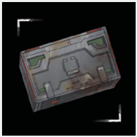
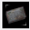
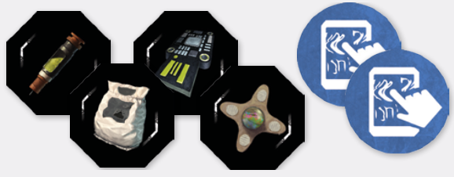
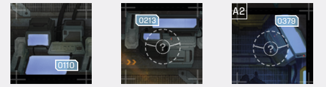

# Scavenging

Scavenging is an Adrenaline  action that allows
you to search your immediate surroundings, open
Gear Caches, find Engrams, interact with Consoles,
and more. **SCAVENGE** is one of the simpler actions
you can take, as it simply allows you to collect a Gear
Cache, Engram or Objective token on your space,
or interact with a Console on your space **without
spending Spacer Tokens**.

**Note:** As an Adrenaline action, Scavenging raises
your Adrenaline and allows you to leave Spacer tokens!

***Full Game:** In the full game, Scavenging will have
additional uses.*

## Fast Scavenging

If you don’t have time to stop and perform a Scavenge
action, you may always **perform Fast Scavenging
during a Move**.

To perform Fast Scavenging, you must first perform
a Move action that takes you to or through a space
with an **Engram**, **Gear Cache** or **Objective** token,
or a **Console**. You must also discard 1/2/3 appropriate Spacer tokens from the Active Spacer Pool.

The exact number of tokens depends on the current
Countdown level (White = 1, Red = 2, Black = 3):

- To pick up an item from a Cache, use Expertise  tokens.
- To pick up an Engram, use Discipline  tokens.
- To interact with a Console, use Confidence  tokens.
- To pick up an Objective token, use the type
  of token indicated by the Objective instructions; if the instructions do not specify the
  token type, use any token type. All the tokens
  must still be of the same type.

**Note:** Fast Scavenging is considered an action.

## Picking Up Gear

  
*Unlooted Gear Cache*

A Gear Cache token  in a Location space represents
an unlooted Gear Cache. When you perform the
Scavenge or Fast Scavenge action on a space with
an unlooted Gear Cache, you remove the token from
the board, to indicate it has been looted, then draw
a card from the location’s loot deck.

When drawing from the loot deck, draw from the
bottom and avoid disturbing the deck’s lid. You immediately gain the card you drew. You may immediately equip it (moving any equipped items to your
backpack) or put it in your backpack. **Observe your
equip, support and backpack slot limits!** If you don’t
have any available slots, you may be forced to discard
something. **All discarded Gear cards are lost.**

**Important: In the full game, Gear cards will be
double-sided. Remember to always gain the Gear
card corresponding to your Parsec number (Blue
One (1), Yellow Two (2) or Red Three (3)). If the card
does not have the appropriate parsec number,
you gain the lower one available.**

## Picking Up Engrams And Objective Tokens

  
*Engrams and Objectives*

Engrams represent useful devices and materials
specific to your current Location, while Objective
tokens represent objectives pertinent to your current
mission or side mission. When you perform the
Scavenge or Fast Scavenge action on a space with
an Engram or Objective token, you simply collect it.

Engram tokens are double-sided. One side shows the
device you’re collecting, while the other the raw
resources you will gain from it once the extraction
run is finished. When you gain an Engram, you always
gain it **device-side up**. Here are the general
rules of Engrams:

- Until the end of the current run, you may
  use the device according to the rules
  of your Location.
- When you use a device-side up Engram, flip
  it to the **resource side** to show it has been
  used. Note that you will still gain the Engram
  resources after the run is finished.
- When the run is finished, flip any unused
  Engrams to their resource side. This means
  there is no point in ‘saving’ the Engram ability,
  as its only usable during the run the Engram
  was gained!
- Engrams don’t take up any slots.

## Interacting With Consoles

  
*Consoles*

Consoles  are interactable elements of locations, used to open or close doors, restore gravity,
vent oxygen, disable or enable security systems
and cameras, and more. When you perform the
Scavenge or Fast Scavenge action on a space with
a Console, refer to the corresponding number in the
Mythos book.

In the Full Game, some consoles will be security-locked,
and will require a test to access.