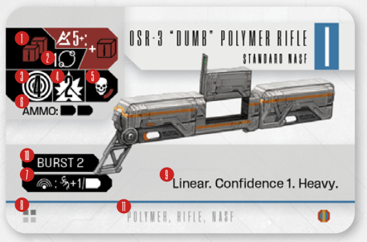

# Weapons And Support Gear

Each Weapon and Gear card In Enormity has
a set of stats and attributes that describe it
and makes it unique. It’s good to learn what
your equipment does before you equip it!

- **(1) Attack Dice:** This shows the number and color of dice you will roll when attacking.
- **(2) Attack Modifiers:** Sometimes
  a weapon grants you a Discipline, Confidence or Expertise modifier during
  the attack. These work exactly like the
  corresponding Spacer tokens, but are
  not tokens and are only applied to the
  current attack.
- **(3) Range:** This shows the range, in board
  spaces, the weapon can attack at.
- **(4) Suppressing Power:** This shows
  the number of Suppressing Power  
  tokens you leave when you fail to wound.
  See [Suppressing](spacer-attacks.md#suppressing) on p. 22 for details.
- **(5) Critical Threshold:** This shows you
  how easy it is to Crit with the weapon.
  Generally, the more red quadrants the
  weapon has, the easier it is to crit with.
  See Check for [Critical Chance](spacer-attacks.md#d-check-for-critical-chance) on p. 21
  for details.
- **(6) Ammo:** These bullet shaped symbols show you the number of Ammo
  ‘units’ the weapon starts with. After
  you deplete all your ammo, you won’t
  be able to use it until you reload it.
  See [Full Reloading](full-reloading.md) on p. 23 and [Fast
  Reloading](fast-reloading.md) on p. 23.
- **Charges:** Some weapons and items
  have charges instead of Ammo. Charges
  are used in the same way as Ammo, but
  once depleted, they will stay that way.
- **(7) Noise:** When used, most weapons
  generate Noise, and this stat shows
  exactly how much.
- **(8) Type:** One-handed, two-handed,
  three-handed, armor or support. Each
  Spacer can carry up to 2 one-handed
  items or 1 two-handed item. Support
  slots vary depending on your Suit.

  **Note:** You always have access to the
  *Standard Multitool* weapon card, it is considered constantly equipped.
- **(9) Keywords:** Common weapon abilities, like Linear, Melee or Reach (you’ll
  find a list of keywords at the end of this
  Rulebook).
- **(10) Effects:** Sometimes a Gear card
  can have a unique effect.
- **(11) Traits:** Properties that help you
  identify an item; they don’t do anything
  on their own, but other effects may
  refer to them.

Some items require you to **exhaust**  them to
use them. If that’s the case, turn the card 90
degrees to the right to denote this. Weapons
with the **Discharge** keyword will unexhaust
at the beginning of your next turn, but all others
will remain exhausted until you use the Rearm
action. See [Exhausting and Rearming](exhausting-and-rearming.md) on p. 19
for details.

Some defensive items may also feature Damage
Reduction , which lowers the damage from
each incoming attack according to its value
(to a minimum of 1).