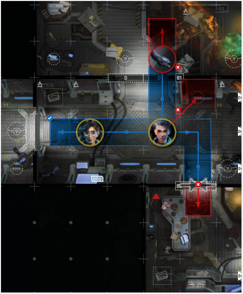
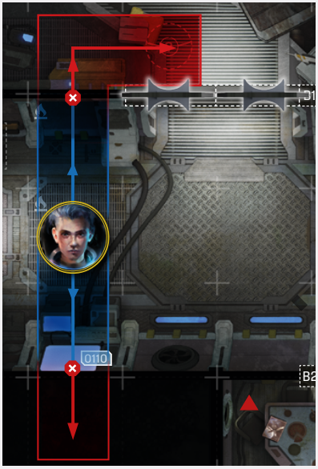
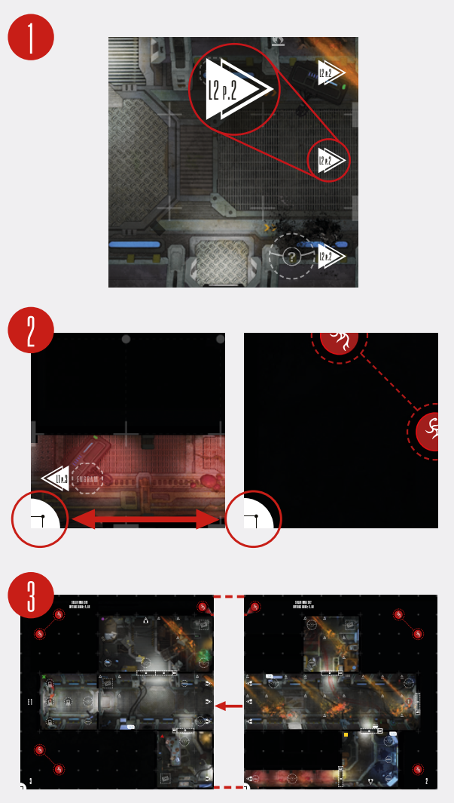

# Spacer Movement

The Move action is, generally, used to move your
Spacer around. Each Move action is accompanied
by a numerical value.

When you perform a Move action, you can move
a number of spaces up to that value. First, declare
the space you want to reach, then move your Spacer,
one space at a time, resolving the effects of any
Terrain tiles you travel through.

There are other general rules and restrictions that
apply to all Move actions:

- **All movement is performed in cardinal
  directions. You cannot move diagonally!**
- You **cannot** move through Obstacles, red
  lines, black lines (walls) or onto Out-OfBounds spaces.
- You **cannot** move through Intruders,
  but **you can** move through other Spacers.
- As part of a single movement, you **cannot**
  move onto the same space twice.
- You must end your movement on an empty
  space (a space that does not contain Obstacles, Intruders or other Spacers).
- Most Move actions **make Noise ** (see
  [Noise Roll](noise-roll.md) on p. 16).
- If a space shows a Location arrow , stop
  on that space and reveal a new Location
  Map (see [Revealing New Location Map](#revealing-new-location-maps) p. 15).
- If a space shows a forced direction arrow , 
  that space enforces your movement
  direction; if you’re on that space, you can
  only move in that arrow’s direction.
- Doors on a map are considered closed (or
  welded, p. 41). You cannot move through
  a Door unless it is opened (removed) from
  the board by another effect (like a Console
  or Keycard)

  
***Spacer Movement Example:** Spacers can only move in cardinal
directions, never diagonally. They cannot move through Intruders or closed doors, but can move through other Spacers.*

  
***Spacer Movement Example:** Spacers cannot move
through black lines (walls) or onto Out-Of-Bounds spaces.*

## Revealing New Location Maps

If you move to the edge of the board marked with
a **Connecting Location symbol **, stop your
movement, find the corresponding Location Map
in the other Location Book and place it adjacent
to your Location Book, as evenly as possible.
The **orientation quadrants  should have the
same alignment**. Then, place every Intruder, Gear
Cache, Engram, Discovery and door marked on the
new Location map. Place starting Blips.
**Remember: If you don’t have an explicit Blip
placement instruction, place exactly one Blip
per newly revealed spawn point cluster (see
[Spawn Point Clusters](spawn-point-clusters.md) on p. 10).**

Finally, you can resume your movement.

  
*When you are about to move into a new Location,
first check the location number 1 and find the
corresponding Location Map in the other Location Book.
Make sure that the orientation quadrants 2 (found
in the bottom left corner of the pages) have the same
alignment and place the new Location adjacent
to your Location Book, as evenly as possible 3.*

Any Intruders on the newly revealed Location that
are also in your Light field (see [Scouting](scouting.md) on p. 18)
are surprised. Place Surprise Status  tokens near
their bases to reflect that (see [Surprised Intruders](resolving-ai-protocols.md#surprised-intruders)
on p. 30).

## Move-Like Ability

If an ability or any other effect allows you to move
without performing a Move action, it is considere
a Move-like ability. **Move-like abilities** are resolved
in the same way as Move actions (unless stated
otherwise), but they are **not** considered Move actions for the purpose of other abilities and effects.

> [!TIP]  
> [Board Spaces, Adjacency, Lines, Intersections And Out-Of-Bounds Spaces](board-spaces-adjacency-lines-intersections-and-out-of-bounds-spaces.md)  
> [Noise Roll](noise-roll.md)  