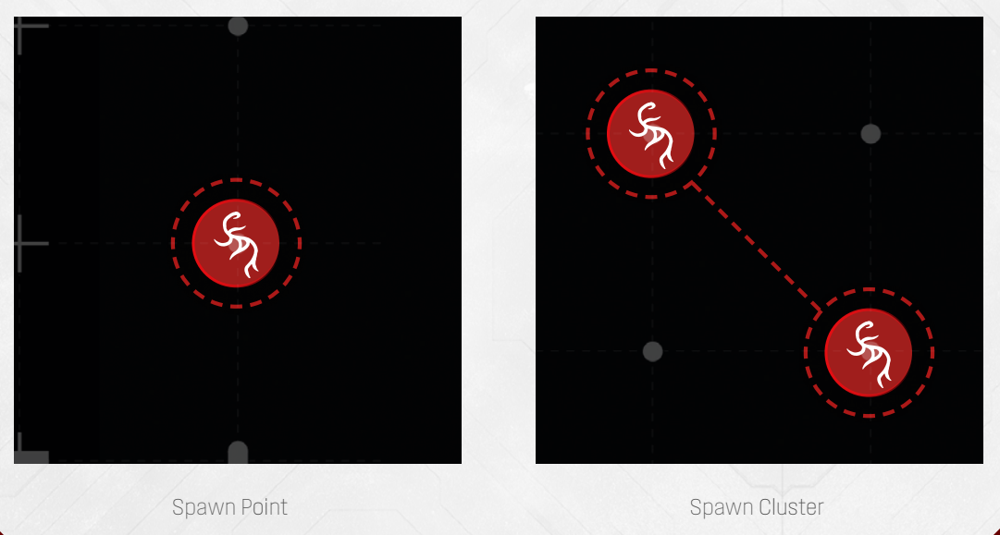

# Spawn Point Clusters

A spawn cluster is one or more spawn points  connected by a red line. When a run doesn’t
explicitly show starting Blip placement, place **exactly one Blip** per spawn cluster, on any of
its spawn points. Note that this will usually be less than the actual number of spawn points
available. Spawn clusters are usually used for **starting Blip placement only**. *For example, the
first Location you’ll encounter will have 5 spawn points, but only 3 spawn clusters.*

